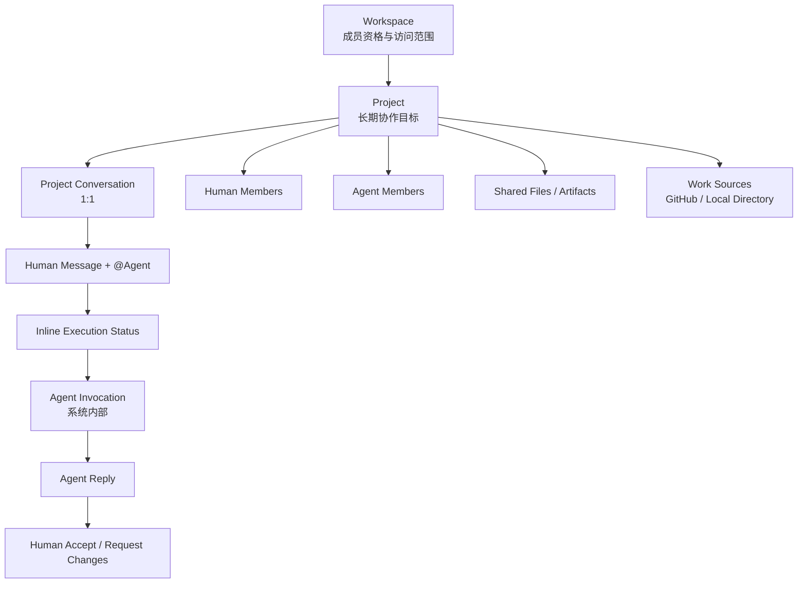
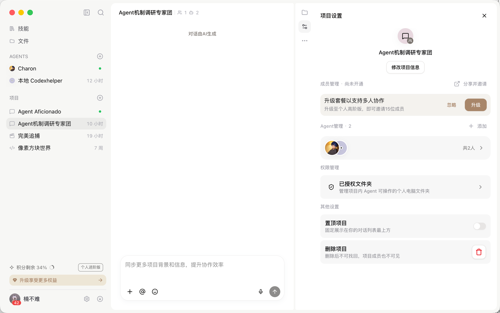
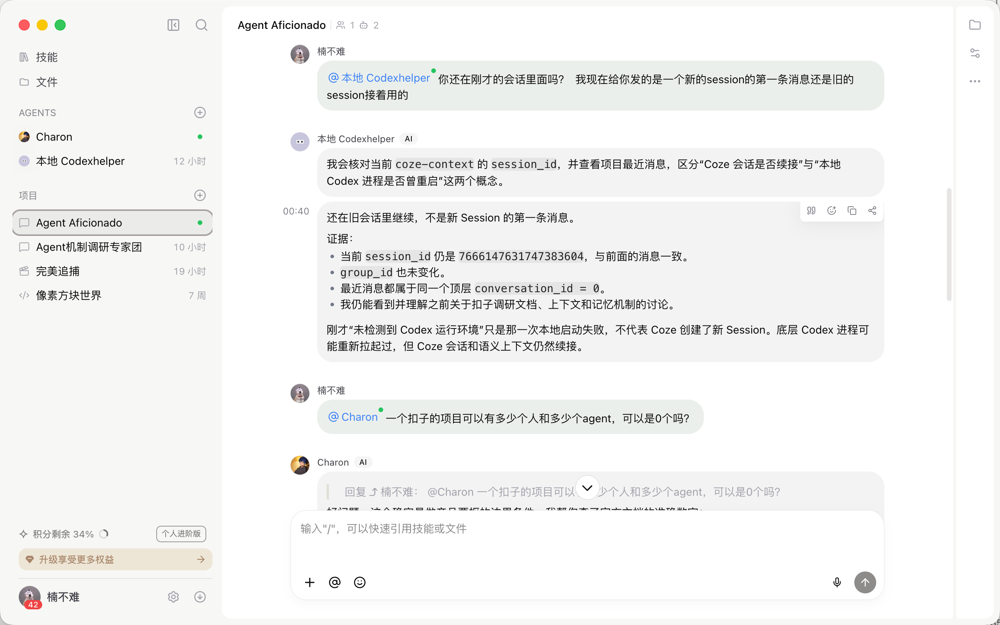
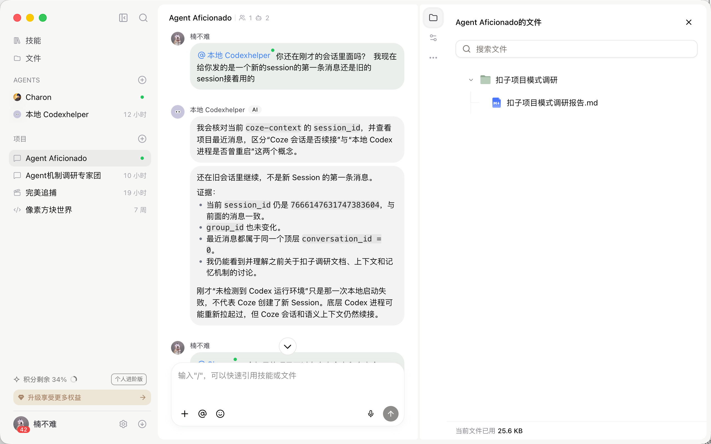
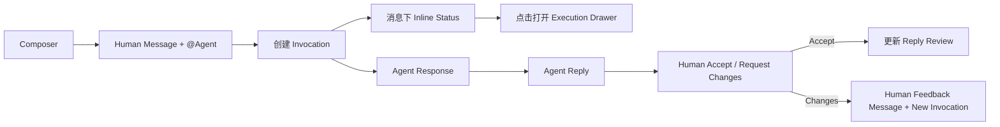
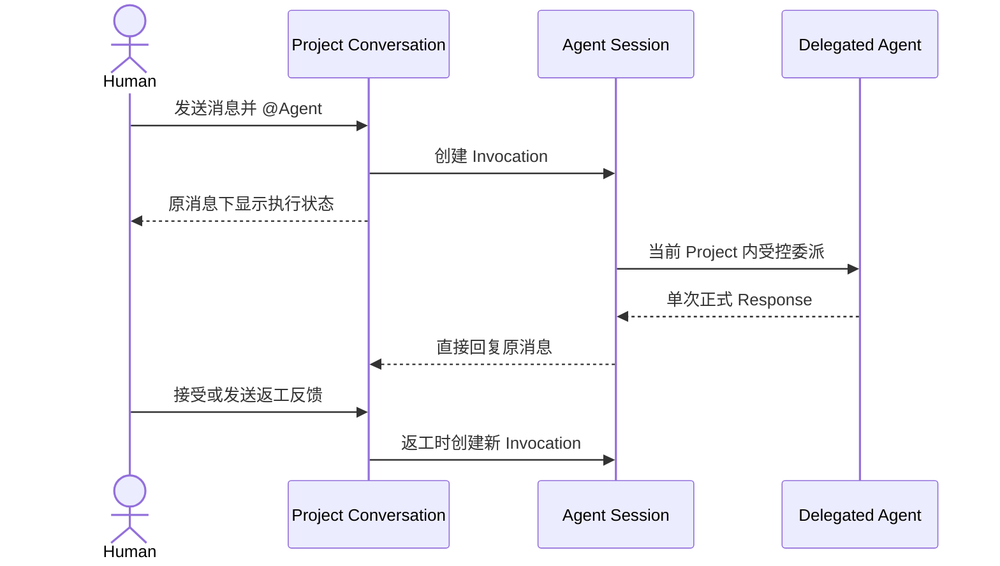

# My Claw 组织协作方案二 PRD：Project Conversation 轻量版

> 文档类型：独立方案 PRD / Coding Agent 实现规格
> 方案名称：方案二 · Project Conversation
> 方案代号：`option-b-coze-light`
> 规格日期：2026-07-27
> 适用代码库：`/Users/nanbunan/Dev-Projects/nexus-platform`
> 推荐实现分支：`feat/my-claw-org-collaboration-coze-prototype`
> 参考调研：[扣子项目模式调研](https://pcnplggdn9ks.feishu.cn/wiki/B2QGw79nGiLj41kzy0Cc28ICnEl?create_from=create_doc_to_wiki)（读取版本：revision 6）
> 视觉参考：本文第 4 节所附 Coze 项目设置、顶层会话与项目文件页面
> 对照方案：`2026-07-27-my-claw-org-collaboration-requirement-change.md`

---

## 0. 文档用途与本次重写结论

本文用于指导 Coding Agent 在独立分支中实现 My Claw 组织协作“方案二”原型。

方案二验证的是 Coze 式轻量协作：

```text
Project
→ 唯一顶层协作会话
→ Human 发送消息并 @Agent
→ 消息下显示一行执行状态
→ Agent 结果直接回复原消息
→ Human 接受或要求返工
```

本次重写删除上一版 PRD 中所有用户可感知的独立任务对象和任务聚合机制。

### 0.1 用户能看到的对象

用户只需要理解：

- Workspace；
- Project；
- Project Conversation；
- Human；
- Agent；
- Message；
- File / Artifact；
- Agent Execution Status；
- Agent Reply；
- Human 接受 / 返工。

### 0.2 用户不能看到的对象

以下只属于系统运行层，不成为产品一级概念：

- Agent Session；
- Agent Invocation；
- Delegation；
- Trigger Envelope；
- Accepted Receipt；
- Tool Event。

---

## 1. 给 Coding Agent 的强制要求

## 1.1 分支隔离

1. 必须从 `main` 基线创建方案二分支。
2. 方案二必须可以在独立 Preview URL 中运行。
3. 不得部署到正式域名。

推荐流程：

```bash
git fetch origin
git switch -c feat/my-claw-org-collaboration-coze-prototype origin/main
```

不要在存在未保存工作时机械执行上述命令；先检查 `git status --short`。

## 1.2 产品语义

1. 一个 Project 恰好拥有一个顶层公开协作会话。
2. Project 根路由打开后直接显示 Conversation。
3. Human 通过发送消息、引用内容、上传文件和 `@` 发起协作。
4. `@Human` 只产生公开 mention 和 Inbox 通知。
5. `@Agent` 产生一次底层 Agent Invocation。
6. Invocation 状态显示为原消息下方的一行轻量状态。
7. 状态行不是卡片，不展示任务标题、任务编号或业务状态。
8. 点击状态行才打开执行详情。
9. Agent 结果作为一条新的 Agent Reply 直接回复原消息。
10. Human 可以接受结果或要求返工。
11. 接受 / 返工是对 Agent Reply 的反馈，不创建新的业务对象。
12. Agent 的执行 session 相互隔离。
13. Agent 结果、公开文件和消息沉淀到 Project 公共上下文。
14. Agent 内部推理、本地临时状态和未发布文件保持隔离。
15. Agent 间委派只能发生在当前 Project Agent Member 范围内。

## 1.3 工程边界

- 不接真实 Coze API。
- 不实现真实 Daemon、WebSocket 或长轮询。
- 不接真实 Agent Runtime。
- 不接真实 GitHub OAuth。
- 不接真实本地目录授权。
- 不改造 Nexus 全局权限体系。
- 不修改现有myclaw个人空间核心能力。
- 不为执行状态增加独立路由。
- 不将整个方案写在一个页面组件中。
- Mock 必须支持状态变化、失败、重试和页面刷新恢复。

---

## 2. 产品定义

## 2.1 一句话定义

> Project Conversation 是一个由多个 Human、个人 Claw、平台 Claw和多智能体组共同参与的公开项目会话；Human 通过消息和 `@` 触发 Agent，Agent 在各自独立 session 中执行，过程以一行状态附着于触发消息，结果直接回复原消息，再由 Human 接受或要求返工。

## 2.2 核心关系



## 2.3 产品原则

1. **Conversation-first**：进入 Project 就开始协作。
2. **Message-first**：工作请求来自消息，不来自表单。
3. **Explicit trigger**：Agent 只有被明确 `@` 才执行。
4. **Status stays inline**：执行状态附着原消息，不形成任务中心。
5. **Result stays conversational**：Agent 结果直接回复，不生成交付页面。
6. **Human closes the loop**：Human 接受或返工。
7. **Public blackboard**：公开消息、文件和结果持久沉淀。
8. **Private runtime**：内部推理与本地状态不共享。
9. **Controlled delegation**：Agent 可以委派，但范围和次数受约束。
10. **Minimum navigation**：Project 只有 Conversation 主体验。

---

## 3. Coze 证据与 My Claw 补充边界

## 3.1 调研已确认或实测

| 机制 | 证据状态 | 方案二处理 |
|---|---|---|
| Project 是协作边界 | 调研确认 | Workspace 下保留 Project |
| Project 与顶层会话 1:1 | 调研确认 | Project 根路由直接显示 Conversation |
| 顶层会话关联多个 Agent session | 调研确认 | 每个 Agent 保留独立 Project session |
| Human 通过消息与 `@Agent` 触发 | 调研确认 | Composer 提供明确 `@` 入口 |
| 消息、文件和 Agent 产物可持续查询 | 调研确认 | 构成 Project 公共黑板 |
| 当前消息、近期片段和路由 ID 自动注入 | 调研与实测确认 | 定义最小 Trigger Envelope |
| 完整成员、全部历史和文件正文不自动注入 | 调研与实测确认 | 权限内按需查询 |
| 同一本地 Agent 可续接先前 session | 已实测 | 默认继续 active session |
| Agent 可向当前 Project Agent 委派 | 调研确认 | 保留受控委派 |
| 单次最多 3 个委派目标 | 调研确认 | Runtime 强校验 |
| request → response，response 只返回一次 | 调研确认 | 防止回环和重复结果 |
| 云端到本地具体通信方式 | 未公开 | 原型不声称是 WebSocket |

## 3.2 My Claw 仅补充的轻量治理

方案二只在 Coze 基础上增加以下用户能力：

- 原消息下的一行执行状态；
- 点击状态行打开的执行详情；
- Agent 在线、离线和 degraded 状态；
- 失败、取消、重试；
- 继续旧 session 或新建 session；
- Agent Reply 下的接受 / 返工；
- 可见但默认折叠的委派链；
- 本地文件发布前的共享确认；
- 全局 Inbox 中的结果、失败和 consent 提醒。

不增加：

- 任务命名；
- 任务编号；
- Task 状态系统；
- 任务聚合；
- 独立验收页；
- 项目进度 Board。

## 3.3 不得过度推断

不得声称：

- session 永远对应同一个常驻 OS 进程；
- 云端一定通过 WebSocket 触发本地 Agent；
- Project 历史等于结构化长期记忆；
- Agent 可以读取其他 Agent 的内部推理；
- Agent 会持续监听全部 Project 消息；
- accepted 回执等于执行完成；
- Agent completed 等于 Human 接受；
- Project 文件全部自动进入模型上下文。


---

## 4. Coze 页面参考与 My Claw 设计转译

本节图片是方案二的页面结构参考，不要求 Coding Agent 逐像素复刻 Coze。

需要借鉴的是：

- Project 根路由就是顶层会话；
- Project 管理能力从当前会话右侧按需展开；
- `@` 是 Human 触发 Human / Agent 协作的统一入口；
- 文件作为 Project 公共工作材料存在；
- 用户处理设置或文件后，仍能回到原来的消息位置。

不得照搬的是：

- Coze 的个人版套餐、积分、升级入口；
- Coze 的全局 Skills / Agents 信息架构；
- Coze 的品牌颜色、字体和视觉资产；
- Coze 未被本 PRD 采用的权限与商业化逻辑；
- 将文件、插件、MCP、知识库混成同一类 Project Resource；
- 将底层 Session / Invocation 暴露为用户需要理解的业务对象。

所有页面继续继承 Nexus / My Claw 现有设计系统。参考图只用于确定布局关系、交互入口和信息层级。

### 4.1 图 1：Project Settings Drawer



#### 图中可观察到的结构

- 左侧是稳定存在的全局导航与 Project 列表；
- 中间仍然保留当前 Project 的顶层会话；
- 点击 Project 设置后，右侧展开宽 Drawer；
- Drawer 内按项目资料、成员 / Agent、授权能力和其他设置分组；
- 用户关闭 Drawer 后不离开当前 Project，也不丢失会话位置。

#### My Claw 应当借鉴

1. Project Header 右侧提供“项目信息”入口。
2. 点击后打开右侧 `ProjectInfoDrawer`，不跳转设置页。
3. Drawer 建议宽度为 `420–520px`；打开后压缩 Conversation 可视宽度，不覆盖左侧导航。
4. Drawer 顶部固定显示标题与关闭按钮，内容区独立滚动。
5. 设置分组至少包括：
   - Project 名称、描述与状态；
   - Workspace 与 Project Brief；
   - Human / Agent 成员摘要；
   - GitHub Repository / Local Directory Work Sources；
   - Project 归档。
6. 成员摘要点击后切换到 `MemberDrawer`，不在设置 Drawer 内继续无限嵌套。
7. 归档属于危险操作，必须二次确认。

#### My Claw 不照搬

- 不显示套餐升级、积分或付费广告；
- 不在 My Claw 内重做 Workspace 角色权限和审计中心；
- 不提供 Coze 式“置顶项目”开关，除非现有 My Claw 已有统一置顶机制；
- 原型阶段不提供不可恢复的真实删除，只提供 Mock 归档；
- “已授权文件夹”只能对应 Local Directory Work Source，不代表所有 Agent 自动拥有访问权；
- Agent 的插件、MCP、知识库和 Skill 跟随 Agent，不出现在 Project 设置中。

### 4.2 图 2：Project 顶层会话与 `@`



#### 图中可观察到的结构

- 用户选择 Project 后直接进入一条顶层公开会话；
- Header 同时展示 Project 名称、Human 数量和 Agent 数量；
- Human 在普通消息中通过 `@Agent` 发起执行；
- Agent 结果直接出现在同一会话，并带有对原消息的回复关系；
- Composer 固定在会话底部，`@` 是一级操作；
- Project 的历史讨论持续保留，不因 Agent Runtime 重启而变成另一条用户可感知会话。

#### My Claw 应当借鉴

1. Project 与 `ProjectConversation` 保持 `1:1`。
2. Project 根路由直接渲染 Conversation，不先经过概览页。
3. Header 紧凑展示 Project 名称、Human 数量、Agent 数量、成员入口、文件入口和项目信息入口。
4. Composer 固定在内容区底部，输入长内容时向上增长，但不得遮挡最新消息。
5. `@` 候选在同一弹层中分组展示 Human、个人 Claw、平台 Claw和多智能体组。
6. Human Message 中被 `@` 的对象必须有明确视觉标识，Agent 还需显示 online / offline / degraded。
7. `@Agent` 后，先在该 Human Message 下显示 Inline Execution Status。
8. Agent 完成后直接回复该 Human Message，不进入独立结果页。
9. Agent Reply 下显示“接受 / 要求返工 / 查看执行”。
10. 页面刷新后恢复当前 Project，以及未结束 Invocation 的派生状态。

#### My Claw 在 Coze 基础上的轻量补充

参考图没有把底层执行状态做成用户一级对象。My Claw 只补充一条贴近原消息的轻量状态：

```text
@需求分析 Claw，请检查方案二的导航逻辑。
└─ 需求分析 Claw · 正在执行 · 2m · 已委派 1 个 Agent
```

点击这一行才打开 `ExecutionDetailDrawer`。

不得增加：

- 活跃任务入口；
- 任务卡片；
- Task 标题或编号；
- Conversation 之外的执行聚合页；
- Project 内的第二层业务会话列表。

### 4.3 图 3：Project Files Drawer



#### 图中可观察到的结构

- 顶层 Conversation 始终保留在中间；
- 文件能力在右侧 Drawer 中打开；
- Drawer 支持搜索、文件夹层级与文件条目；
- 文件属于当前 Project，而不是某一个 Agent 的私有 Session；
- 关闭 Drawer 后继续原会话。

#### My Claw 应当借鉴

1. 点击 Project Header 的文件入口打开 `FilesArtifactsDrawer`。
2. Drawer 与 `ProjectInfoDrawer` 使用相同的右侧容器、宽度和关闭行为。
3. 文件区至少支持：
   - 按名称搜索；
   - 文件夹展开 / 收起；
   - 文件类型、作者、来源与更新时间；
   - Human 上传文件；
   - Agent 公开发布的 Artifact；
   - 跳转到来源消息；
   - 空状态与搜索无结果状态。
4. 点击文件默认打开预览或详情；点击“查看来源消息”关闭 Drawer 并定位到 Conversation 中的关联消息。
5. Project 文件是公共黑板的一部分，可以被有权限的 Agent 按需查询。
6. 文件正文不因其出现在 Drawer 中就自动注入每次 Agent 调用。

#### 文件、Work Source 与 Agent Capability 的边界

| 类型 | 所属层级 | Drawer 中如何出现 | Agent 如何获得 |
|---|---|---|---|
| Human 上传文件 | Project | 文件树中的公开文件 | 权限内按需读取 |
| Agent Artifact | Project | 文件树中的公开产物 | 发布后供成员按需读取 |
| GitHub Repository | Project Work Source | 独立来源分组或绑定信息 | Runtime 按授权读取 |
| Local Directory | Project Work Source | 独立来源分组或绑定信息 | 仅具备本地授权的 Runtime 可读 |
| Skill / 插件 / MCP / 知识库 | Agent Capability | 不进入 Project 文件树 | 跟随具体 Agent |
| 临时文件 / 内部推理 | Agent Session | 不进入 Drawer | 仅对应 Agent Runtime 可见 |

因此，参考图中的“文件”在 My Claw 中不能被解释为所有资源的总入口。

### 4.4 统一页面骨架

三张参考图共同约束方案二使用同一个页面骨架：

```text
┌──────────────────┬─────────────────────────────────┬──────────────────────┐
│ My Claw Sidebar  │ Project Conversation            │ Optional Drawer      │
│                  │                                 │                      │
│ Context Selector │ Project Header                  │ Project Info         │
│ Inbox            │ Message Stream                  │ Members              │
│ 协作会话          │ Inline Execution Status         │ Files & Artifacts    │
│                  │ Agent Reply + Review            │ Execution Detail     │
│                  │ Composer                        │                      │
└──────────────────┴─────────────────────────────────┴──────────────────────┘
```

交互规则：

- 默认状态只有 Sidebar + Conversation；
- 同一时间只允许打开一个右侧 Drawer；
- 切换 Drawer 不改变路由；
- Drawer 打开前记录 Conversation 滚动锚点；
- 关闭 Drawer 后恢复该锚点；
- 1280px 及以上优先采用并列布局；
- 较窄宽度下 Drawer 可以覆盖 Conversation，但必须保留清晰关闭入口；
- Project 设置、成员、文件和执行详情不得各自创建子路由；
- Coding Agent 应复用同一个 Drawer Shell，但每类 Drawer 必须保留独立组件和数据契约。

### 4.5 视觉参考的实现优先级

| 优先级 | 必须验证的设计 | 原型要求 |
|---|---|---|
| P0 | 选择 Project 后直接进入顶层会话 | 必须实现 |
| P0 | `@Agent` 与 Agent Reply 位于同一 Conversation | 必须实现 |
| P0 | 文件 / 设置从右侧展开且不跳路由 | 必须实现 |
| P0 | Drawer 关闭后回到原消息位置 | 必须实现 |
| P0 | Inline Execution Status 贴在触发消息下 | 必须实现 |
| P1 | 文件搜索、文件夹展开与来源消息定位 | 使用 Mock 完整演示 |
| P1 | Human / Agent 数量与 Member Drawer 联动 | 使用 Mock 完整演示 |
| P1 | Project Info 与 Work Source 管理 | 使用 Mock 完整演示 |
| P2 | 窄屏 Drawer 覆盖模式 | 至少保证可用 |

---

## 5. 用户与典型场景

## 5.1 Human

Human 可以：

- 创建或加入 Project；
- 发送公开消息；
- 引用消息或文件；
- `@Human` 请求确认；
- `@Agent` 请求执行；
- 查看执行状态；
- 查看执行详情；
- 接受 Agent Reply；
- 要求返工；
- 添加或移除成员。

## 5.2 个人 Claw

个人 Claw：

- 与一个 Human 一对一绑定；
- 经 owner 同意进入 Project；
- 使用自己的模型、Skill、插件、MCP、知识库和本地工具；
- 在收到 `@` 后创建或续接 Project session；
- 读取明确授权的 Project 内容；
- 将公开结果回复到 Project Conversation。

## 5.3 平台 Claw

平台 Claw：

- 由 Nexus Platform 发布；
- 没有 Human owner；
- 保留平台配置的 Capability；
- 可作为 Project Agent Member 被 `@`；
- 可参与受控委派。

## 5.4 多智能体组

多智能体组：

- 作为一个完整 Agent Member 加入 Project；
- Project 不展开其内部子 Agent；
- 对外显示一个状态；
- 对外返回一条汇总结果；
- 内部编排属于自身 Runtime。

## 5.5 典型流程

```text
产品经理发送需求并 @产品 Claw
→ 消息下显示“产品 Claw · 正在执行”
→ 产品 Claw受控委派设计 Claw
→ 状态行显示“已委派 1 个 Agent”
→ 产品 Claw直接回复方案
→ 产品经理点击“接受”
→ 继续 @若楠的 Claw实现代码
→ 若楠的 Claw直接回复 commit 和 Preview URL
```

---

## 6. 信息架构

## 6.1 用户感知层级

```text
My Claw
├── 个人空间
└── Project
    └── Project Conversation
```

成员、文件、Artifact、Project Brief 和 Work Source 通过 Drawer 展示，不形成左侧一级页面。

## 6.2 工作上下文选择器

使用已确认的低负担结构：

```text
搜索 Project…

个人空间

AgentFoundry 产研空间
  Claw 组织协作机制
  知识库 2.0

科研项目协同空间
  科研 Agent 协作
```

要求：

- “个人空间”是独立选项；
- Project 按 Workspace 分组；
- Workspace 标题不可选择；
- 不显示“个人”分组标题；
- 不显示“最近”“全部”“查看全部”；
- 点击 Project 直接进入 Conversation；
- 搜索结果仍保留 Workspace 分组；
- 当前 Project 显示选中；
- 触发器第一行显示 Project，第二行显示 Workspace。

## 6.3 Project 左侧栏

Project 模式左侧栏只显示：

```text
工作上下文选择器
Inbox

协作会话
```

不得出现：

- Project Overview；
- Issue；
- Squad；
- Context；
- Files；
- Members；
- Activity；
- 返回项目列表；
- Workspace 首页。

文件、成员和 Project 信息统一从 Conversation Header 打开。

## 6.4 路由

```text
/my-claw
/my-claw/inbox
/my-claw/workspaces/[workspaceId]/projects/[projectId]
```

Project Deep Link 使用 query 或 hash 定位消息：

```text
/my-claw/workspaces/[workspaceId]/projects/[projectId]?message=[messageId]
```

不得创建 Project 子路由。

---

## 7. Project Conversation 页面

## 7.1 页面目标

在一个页面完成：

- 查看公开项目历史；
- 发送消息；
- 上传文件；
- 引用消息；
- `@Human`；
- `@Agent`；
- 查看 Agent 执行状态；
- 查看执行详情；
- 接收 Agent Reply；
- 接受或返工；
- 打开成员、文件和 Project 信息。

## 7.2 页面布局

```text
┌────────────────────────────────────────────────────────────┐
│ Project Header                                             │
│ 名称 · Workspace · Human/Agent 头像 · 文件 · Project 信息   │
├────────────────────────────────────────────────────────────┤
│                                                            │
│ Project Conversation                                       │
│                                                            │
│ Human Message                                              │
│ └─ Agent · 正在执行 · 2m · 已委派 1 个 Agent               │
│                                                            │
│ Agent Reply                                                │
│ [接受] [要求返工] [查看执行]                                │
│                                                            │
├────────────────────────────────────────────────────────────┤
│ Composer：消息 / @成员 / 文件 / 引用 / 发送                 │
└────────────────────────────────────────────────────────────┘
```

页面默认没有右侧常驻面板。

Drawer 只在用户主动点击时打开。

打开任一 Drawer 后，页面必须符合第 4.4 节的三栏骨架：

- 左侧导航保持稳定；
- Conversation 仍然可见；
- 右侧只显示当前 Drawer；
- 不通过路由切换模拟 Drawer；
- 关闭后恢复打开前的消息滚动锚点。

## 7.3 Project Header

左侧：

- Project 名称；
- Project 状态；
- Workspace 名称，弱化显示；
- 一行 Project 描述。

右侧：

- Human 头像组与数量；
- Agent 头像组与数量；
- 添加成员；
- 文件与产物；
- Project 信息。

不得显示：

- 活跃任务数量；
- Issue 数量；
- Squad 数量；
- 运行状态总览；
- Project 统计卡。

## 7.4 Message 类型

```ts
export type ProjectMessageKind =
  | "human"
  | "agent_reply"
  | "file_share"
  | "system";
```

Human Message 支持：

- 普通文本；
- `@Human`；
- `@Agent`；
- 引用消息；
- 文件；
- Work Source 文件引用。

Agent Reply 支持：

- 文本摘要；
- Artifact；
- commit；
- pull request；
- Preview URL；
- 失败说明；
- 对原始消息的 reply 关系；
- Human Review 状态。

System Message 只显示：

- 成员变更；
- Agent 状态变更；
- Work Source 变更；
- Human 接受 / 返工事件。

系统消息视觉权重必须低于正常对话。

---

## 8. Composer 与 `@`

## 8.1 Composer 能力

- 多行输入；
- `@` Human / Agent；
- 上传文件；
- 引用一条消息；
- 引用 Project 文件；
- 引用 GitHub / Local Directory 文件；
- 发送；
- `Enter` 发送；
- `Shift + Enter` 换行；
- `Esc` 关闭候选列表。

## 8.2 `@` 候选

```text
Human
  若楠
  林晓

个人 Claw
  若楠的 Claw · Online
  林晓的 Claw · Offline

平台 Claw
  需求分析 Claw · Online
  自动化测试 Claw · Degraded

多智能体组
  产品设计多智能体 · Busy
```

Agent 候选显示：

- 名称；
- 类型；
- owner；
- online / busy / offline / degraded；
- 能力摘要；
- 是否可执行。

## 8.3 `@Human`

发送后：

- 创建普通 Human Message；
- 记录 mention；
- 向目标 Human Inbox 发送通知；
- 不创建 Agent Session；
- 不创建 Invocation；
- 不显示执行状态。

## 8.4 `@Agent`

发送后：

1. 创建 Human Message；
2. 为每个被 `@` 的 Agent 创建一个 Invocation；
3. 创建或续接对应 Project-Agent Session；
4. 在原消息下显示每个 Agent 的一行状态；
5. Agent 完成后直接创建 Agent Reply；
6. Human 可接受或返工。

Human 一条消息最多直接 `@` 3 个 Agent。

超过时阻止发送：

> 单次最多指派 3 个 Agent，请拆分消息。

多个 Agent 被触发时：

```text
@产品 Claw @设计 Claw，请分别给出判断

产品 Claw · 正在执行 · 1m
设计 Claw · 等待运行 · Offline
```

每个 Agent 独立回复原消息。

---

## 9. Inline Execution Status

## 9.1 产品定位

Inline Execution Status 是 Invocation 的轻量视图，不是业务对象。

它只回答：

- 哪个 Agent 被触发；
- 当前是否排队、运行、完成、失败或取消；
- 是否发生委派；
- 是否有结果回复；
- 是否可打开执行详情。

它不提供：

- 标题；
- 编号；
- 优先级；
- 截止时间；
- 负责人字段；
- 业务状态；
- 任务详情；
- Task 列表；
- Board；
- 聚合入口。

## 9.2 展示位置

状态行必须紧跟触发它的 Human Message。

不得显示在：

- 左侧栏；
- Project Header；
- 独立抽屉列表；
- 独立页面；
- Workspace 页面。

## 9.3 状态映射

```ts
export type AgentInvocationStatus =
  | "queued"
  | "running"
  | "completed"
  | "failed"
  | "cancelled";
```

渲染：

```text
queued
需求分析 Claw · 等待运行

running
需求分析 Claw · 正在执行 · 2m

running with delegation
需求分析 Claw · 正在执行 · 2m · 已委派 1 个 Agent

completed
需求分析 Claw · 已回复 · 4m 18s

failed
需求分析 Claw · 执行失败 · Runtime offline · [重试]

cancelled
需求分析 Claw · 已取消
```

状态行整体可点击。

可以包含：

- Agent 小图标；
- Agent 名称；
- 状态文字；
- 耗时；
- 委派数量；
- 重试按钮；
- 取消按钮。

不得做成高边框、大面积背景的 Card。

## 9.4 多次 Invocation

Human 要求返工时会产生新的 Invocation。

原消息下只显示最新 Invocation 状态，旁边显示：

```text
第 2 次执行
```

点击后在执行详情中查看全部历史 Invocation。

历史不能被覆盖或删除。

---

## 10. Agent Reply 与 Human Review

## 10.1 Agent Reply

Agent 完成后直接在 Conversation 中回复原消息。

```text
需求分析 Claw
回复若楠：

已完成 Coze 协作模式分析，核心建议如下……

组织协作方案.md

[接受] [要求返工] [查看执行]
```

Reply 必须显示：

- Agent；
- Agent 类型；
- 原始消息引用；
- 结果摘要；
- Artifact；
- 耗时；
- 来源；
- 接受 / 返工；
- 查看执行。

## 10.2 Review 状态

Review 是 Agent Reply 的字段，不是独立对象。

```ts
export type AgentReplyReviewStatus =
  | "unreviewed"
  | "accepted"
  | "changes_requested";
```

```ts
export interface AgentReplyReview {
  status: AgentReplyReviewStatus;
  reviewedByUserId?: string;
  reviewedAt?: string;
  feedbackMessageId?: string;
}
```

## 10.3 接受

点击“接受”：

- Reply 显示“若楠已接受”；
- 写入 reviewedBy 和 reviewedAt；
- Conversation 增加一条弱化 System Message；
- 不创建任务完成记录；
- 不改变 Invocation completed 状态；
- 不创建新对象。

## 10.4 要求返工

点击“要求返工”：

1. 打开简短反馈输入框；
2. Human 输入修改意见；
3. 反馈作为一条新的 Human Message 回复 Agent Reply；
4. 旧 Reply 标记 changes_requested；
5. 为同一目标 Agent 创建新的 Invocation；
6. 默认继续原 Project-Agent Session；
7. 新 Invocation 状态显示在反馈消息下；
8. 新结果再次直接回复反馈消息。

返工不是修改旧 Invocation。

## 10.5 继续追问

Human 也可以不点击 Review 操作，直接回复 Agent。

只有回复中再次 `@Agent` 才创建新 Invocation。

---

## 11. Execution Detail Drawer

## 11.1 打开入口

只能从以下位置打开：

- Inline Execution Status；
- Agent Reply 的“查看执行”；
- Inbox 中的失败提醒。

不存在全局执行列表。

## 11.2 Drawer 内容

```text
执行摘要
Agent
Session
Invocation
状态与耗时
输入引用

执行时间线
  接收请求
  查询项目消息
  读取文件
  调用工具
  委派 Agent
  生成 Artifact
  回传结果

委派链
Artifact
失败原因

[取消] [重试]
```

## 11.3 展示边界

可以展示：

- 外部工具调用名称；
- 文件读取事件；
- 文件修改事件；
- 委派 request / accepted / response；
- Artifact；
- 状态；
- 错误；
- 耗时；
- token / cost mock。

不得展示：

- chain-of-thought；
- 隐藏系统指令正文；
- Credential；
- 其他 Agent 的私有 session；
- 未发布本地文件。

## 11.4 关闭行为

关闭 Drawer 后：

- 返回原消息位置；
- 不跳转页面；
- Conversation 滚动位置不变；
- 不增加左侧导航历史。

---

## 12. Agent Session 与 Invocation

## 12.1 Project-Agent Session

定义：

> 某个 Agent 在某个 Project Conversation 中可续接的私有运行上下文。

关系：

```text
Project Conversation 1:N Project-Agent Session
Agent 1:N Project-Agent Session
Project-Agent Session 1:N Invocation
```

规则：

- 首次 `@Agent` 创建 session；
- 后续触发默认续接最近 active session；
- Agent 只能读取自己的 session；
- Human 返工默认继续 session；
- 重试时可选择 continue 或 new；
- session 状态可为 active、paused、expired、error；
- session 不等于 Human；
- session 不等于 Project；
- session 不保证是永久存活的同一 OS 进程。

## 12.2 Invocation

Invocation 是一次底层执行。

记录：

- Project；
- Thread；
- source message；
- Agent；
- session；
- status；
- input refs；
- delegation；
- tool events；
- Artifact；
- response message；
- error；
- start / complete time。

Invocation 不包含：

- 业务标题；
- 业务优先级；
- 截止时间；
- 负责人字段；
- 验收人字段；
- Project Board 状态。

## 12.3 Invocation 与 Review 的边界

```text
Invocation completed
≠ Human accepted
```

Invocation 只描述 Agent 是否完成技术执行。

Human Review 只描述 Human 对 Agent Reply 的态度。

二者不能合并成一个状态。

---

## 13. 受控 Agent 委派

## 13.1 产品定位

Agent 委派发生在一次 Invocation 内，不创建持久团队。

主 Agent：

- 查询当前 Project 的 Agent Members；
- 选择合适目标；
- 发出明确子请求；
- 消费子结果；
- 对 Human 返回统一 Agent Reply。

## 13.2 硬约束

1. 目标必须是当前 Project active Agent Member。
2. 禁止委派自己。
3. 禁止重复目标。
4. 单次最多 3 个目标。
5. 原型只允许一层委派。
6. 必须携带当前 Project、Message、Session 和 parent Invocation。
7. request 与 response 成对。
8. 每个子请求只允许正式 response 一次。
9. accepted 只表示受理或排队。
10. 子 Agent 结果先回到主 Agent。
11. 由主 Agent 向 Project 返回统一结果。

## 13.3 Conversation 中的展示

Conversation 不插入独立的子 Agent 消息。

原消息下状态行显示：

```text
产品 Claw · 正在执行 · 已委派 1 个 Agent
```

点击后在 Drawer 中显示：

```text
产品 Claw
└── 设计 Claw · Running
```

如果子 Agent 失败：

- 主 Invocation 可以继续或失败；
- 主 Agent 必须在最终 Reply 中说明影响；
- Drawer 显示子失败详情。

---

## 14. Human、个人 Claw 与 Project 成员

## 14.1 一人一 Claw

```text
Human 1 ←→ 1 Personal Claw
```

约束：

- `personal_claw.ownerUserId` 必填且唯一；
- 同一 Human 不能有多个个人 Claw；
- 平台 Claw和多智能体没有 Human owner。

## 14.2 Project Member

```ts
export type ProjectMember =
  | {
      kind: "human";
      userId: string;
      role: "owner" | "member";
      state: "active" | "invited";
    }
  | {
      kind: "agent";
      actorId: string;
      actorType:
        | "personal_claw"
        | "platform_claw"
        | "multi_agent_group";
      state:
        | "active"
        | "pending_consent"
        | "offline"
        | "degraded";
    };
```

## 14.3 成员联动

添加个人 Claw：

- 自动确保 owner Human 已在 Project；
- owner 未加入时同时创建 Human invitation；
- 他人的个人 Claw需要 owner consent；
- consent 前不可执行；
- 拒绝后移除个人 Claw。

添加 Human：

- 不自动激活其个人 Claw；
- Human 可以只进行人工协作；
- Human 可随后授权自己的 Claw。

添加平台 Claw或多智能体：

- 不增加 Human；
- 按平台状态进入 active 或 degraded。

## 14.4 Member Drawer

从 Project Header 头像组打开。

分两组：

```text
Human
  若楠 · Owner
  林晓 · Member

Agent
  若楠的 Claw · Personal · Online
  需求分析 Claw · Platform · Online
  产品设计多智能体 · Multi-agent · Busy
```

Drawer 支持：

- 添加成员；
- 查看状态；
- 查看能力摘要；
- 发起 consent；
- 移除成员。

不得创建成员独立页面。

---

## 15. Project Context

## 15.1 机制结论

Project Context 是：

> 共享资产 + 局部自动注入 + 权限内按需查询。

不是：

> 全部历史、全部文件和所有 Agent session 组成的无限模型窗口。

## 15.2 公共黑板

Project 持久保存：

- 公开 Human Message；
- 公开 Agent Reply；
- reply 链；
- mention；
- Project 文件；
- Agent Artifact；
- Human 接受 / 返工；
- 成员变更；
- Work Source 元数据。

底层 Invocation 和 Tool Event 仅按权限审计，不自动成为 Conversation 消息。

## 15.3 自动注入

Agent 被 `@` 时自动获得：

- 当前触发消息；
- 发言人；
- 被引用消息；
- 近期相关消息片段；
- workspaceId；
- projectId；
- threadId；
- messageId；
- actorId；
- current session ref；
- 显式文件引用；
- 显式 Work Source 引用。

不自动获得：

- 全部 Project 历史；
- 完整成员列表；
- 全部文件正文；
- 全量 GitHub Repository；
- 全量 Local Directory；
- 其他 Agent session；
- 其他 Project；
- 个人空间私聊。

## 15.4 按需查询

Agent 可按权限查询：

- Project Brief；
- Human / Agent Members；
- 更早消息；
- 指定 reply 链；
- Project 文件列表；
- 指定文件正文；
- Artifact；
- GitHub 文件；
- Local Directory 文件；
- 自己的历史 Invocation 摘要。

查询事件进入 Execution Detail。

## 15.5 隔离

始终隔离：

- Agent 内部推理；
- 未发布草稿；
- 本地临时状态；
- 未授权本地文件；
- 其他 Agent 私有 session；
- 其他 Project 历史；
- Credential；
- 其他用户个人记忆。

## 15.6 不实现关系记忆

本期不实现：

- Human × Agent 偏好记忆；
- Project × Human 成员画像；
- Project × Human × Agent 关系记忆。

Project 公共黑板不等于关系记忆。

---

## 16. Agent Capability、Work Source 与文件

## 16.1 Agent Capability

跟随 Agent：

- 模型；
- 系统指令；
- Skill；
- 插件；
- MCP；
- 知识库；
- Workflow；
- 工具策略；
- Credential 引用；
- 多智能体内部编排。

Project 不复制 Agent Capability。

Project 中的 Agent 不互相继承能力。

## 16.2 Project Work Source

只允许：

```ts
export type ProjectWorkSourceType =
  | "github_repository"
  | "local_directory";
```

GitHub Repository：

- URL；
- owner / repo；
- branch / ref；
- subpath；
- read / read_write；
- availability。

Local Directory：

- display name；
- local path；
- subpath；
- read / read_write；
- available / unavailable / authorization_required；
- 提供访问能力的 Agent Runtime。

绑定 Local Directory 不代表所有 Agent 都能访问。

## 16.3 Files & Artifacts Drawer

从 Project Header 打开。

展示：

- 搜索框；
- 文件夹层级；
- Human 上传文件；
- Agent Artifact；
- report；
- commit；
- pull request；
- Preview URL；
- link。

字段：

- 名称；
- 类型；
- 创建者；
- 来源；
- 关联消息；
- 关联 Invocation；
- 时间；
- 可见范围。

交互：

- 文件夹支持展开 / 收起；
- 搜索同时匹配文件名和文件夹名；
- 搜索无结果时展示明确空状态；
- 点击文件打开预览或详情；
- 点击“查看来源消息”关闭 Drawer 并回到产生该文件的消息；
- Drawer 关闭后恢复原 Conversation 滚动位置。

不得创建独立 Files 页面。

## 16.4 Project Info Drawer

展示：

- Project 名称；
- 描述；
- Workspace；
- Project Brief；
- Work Sources；
- 创建人；
- 创建时间；
- 归档操作。

布局和行为参考第 4.1 节：

- 顶部固定标题与关闭按钮；
- 基础资料、成员摘要、Work Sources、危险操作分组展示；
- 点击成员摘要切换到 Member Drawer；
- 不承载套餐、积分或升级信息；
- 不承载 Agent 的 Skill、插件、MCP 或知识库配置；
- 不执行真实删除。

Project Brief 由 Human 编辑。

Agent 不得静默修改。

---

## 17. Trigger、Receipt 与 Response Contract

## 17.1 Trigger Envelope

```ts
export interface AgentTriggerEnvelope {
  mode: "request";

  workspaceId: string;
  projectId: string;
  threadId: string;
  messageId: string;

  source: {
    kind: "human" | "agent";
    id: string;
  };

  targetActorId: string;
  text: string;
  quotedMessageIds: string[];
  fileRefs: string[];
  workSourceRefs: string[];

  sessionPolicy: "continue" | "new";
  currentSessionId?: string;
  parentInvocationId?: string;
}
```

所有 ID 必须来自当前路由和消息。

不得由模型猜测或复用其他 Project 的 ID。

## 17.2 Accepted Receipt

```ts
export interface AgentAcceptedReceipt {
  mode: "accepted";
  invocationId: string;
  sessionId: string;
  status: "queued" | "running";
  acceptedAt: string;
}
```

Accepted 只表示：

- 身份和权限通过；
- Agent 被找到；
- Invocation 已排队或启动。

不得渲染为已完成。

## 17.3 Response Envelope

```ts
export interface AgentResponseEnvelope {
  mode: "response";

  workspaceId: string;
  projectId: string;
  threadId: string;
  replyToMessageId: string;
  invocationId: string;
  actorId: string;

  status: "completed" | "failed" | "cancelled";
  summary: string;
  artifactIds: string[];
  delegationIds: string[];

  error?: {
    code: string;
    message: string;
    retryable: boolean;
  };

  respondedAt: string;
}
```

同一个 Invocation 只能正式 response 一次。

后续补充必须通过新的 Message 或新的 Invocation。

## 17.4 前端渲染路径



不得：

- 把 accepted 显示为 completed；
- 把 completed 显示为 Human accepted；
- 把 failed 隐藏成普通回复；
- 为 Review 创建独立任务对象。

---

## 18. Inbox

Inbox 是用户级全局对象，个人空间和全部 Project 共用。

事件：

```ts
export type InboxEventType =
  | "human_mentioned"
  | "agent_reply_ready"
  | "agent_execution_failed"
  | "personal_claw_consent"
  | "project_invitation"
  | "session_degraded";
```

Project Inbox Item 携带：

- workspaceId；
- projectId；
- threadId；
- messageId；
- 适用时 invocationId。

点击后：

1. 直接进入目标 Project；
2. 滚动到对应消息；
3. 高亮消息；
4. 失败事件可自动打开 Execution Drawer；
5. 不进入 Workspace 首页。

Inbox 不提供任务列表。

---

## 19. Nexus Platform 最小改动

方案二不需要：

- Squad 看板；
- Issue 看板；
- Project 任务看板。

只新增或调整：

> Agent 协作接入看板

展示：

- Agent 名称；
- personal / platform / multi-agent；
- owner；
- Workspace；
- 加入 Project 数；
- online / busy / offline / degraded；
- active session 数；
- running invocation 数；
- 最近失败；
- 最近心跳。

详情 Drawer：

- Capability 摘要；
- 所属 Project；
- session；
- Invocation；
- Runtime 环境摘要；
- 最近错误。

Nexus Platform 不负责：

- Project 消息；
- Human Review；
- Project 文件；
- 成员邀请；
- Agent 委派操作。

---

## 20. 核心数据模型

```ts
export interface CollaborationProject {
  id: string;
  workspaceId: string;
  name: string;
  description: string;
  status: "active" | "archived";
  ownerUserId: string;
  threadId: string;
  brief: string;
  humanMemberIds: string[];
  agentMemberIds: string[];
  workSourceIds: string[];
  createdAt: string;
  updatedAt: string;
}

export interface ProjectThread {
  id: string;
  workspaceId: string;
  projectId: string;
  messageIds: string[];
  createdAt: string;
  updatedAt: string;
}

export interface ProjectMessage {
  id: string;
  workspaceId: string;
  projectId: string;
  threadId: string;
  kind: ProjectMessageKind;
  author:
    | { kind: "human"; id: string }
    | { kind: "agent"; id: string }
    | { kind: "system"; id: "system" };
  content: string;
  replyToMessageId?: string;
  mentionedHumanIds: string[];
  mentionedActorIds: string[];
  quotedMessageIds: string[];
  fileIds: string[];
  artifactIds: string[];
  invocationIds: string[];
  agentReview?: AgentReplyReview;
  createdAt: string;
  editedAt?: string;
}

export interface AgentActor {
  id: string;
  workspaceId: string;
  type:
    | "personal_claw"
    | "platform_claw"
    | "multi_agent_group";
  name: string;
  description: string;
  ownerUserId?: string;
  runtimeStatus:
    | "online"
    | "busy"
    | "offline"
    | "degraded";
  capabilitySummary: string[];
  lastHeartbeatAt?: string;
}

export interface ProjectAgentSession {
  id: string;
  workspaceId: string;
  projectId: string;
  threadId: string;
  actorId: string;
  status: "active" | "paused" | "expired" | "error";
  invocationIds: string[];
  lastSummary: string;
  createdAt: string;
  updatedAt: string;
}

export interface AgentInvocation {
  id: string;
  workspaceId: string;
  projectId: string;
  threadId: string;
  sourceMessageId: string;
  responseMessageId?: string;
  sessionId: string;
  actorId: string;
  status: AgentInvocationStatus;
  inputRefs: string[];
  delegationIds: string[];
  artifactIds: string[];
  eventIds: string[];
  summary: string;
  errorCode?: string;
  errorMessage?: string;
  startedAt?: string;
  completedAt?: string;
}

export interface AgentDelegation {
  id: string;
  workspaceId: string;
  projectId: string;
  parentInvocationId: string;
  sourceActorId: string;
  targetActorId: string;
  requestSummary: string;
  status:
    | "requested"
    | "accepted"
    | "running"
    | "responded"
    | "failed"
    | "rejected";
  acceptedAt?: string;
  respondedAt?: string;
}

export interface ProjectFileNode {
  id: string;
  workspaceId: string;
  projectId: string;
  nodeType: "folder" | "file";
  parentFolderId?: string;
  name: string;
  mimeType?: string;
  sizeBytes?: number;
  source: "human_upload" | "agent_artifact";
  sourceMessageId?: string;
  invocationId?: string;
  createdBy:
    | { kind: "human"; id: string }
    | { kind: "agent"; id: string };
  visibility: "project";
  createdAt: string;
  updatedAt: string;
}

export interface ProjectArtifact {
  id: string;
  workspaceId: string;
  projectId: string;
  sourceMessageId: string;
  invocationId?: string;
  fileNodeId?: string;
  name: string;
  kind:
    | "file"
    | "report"
    | "link"
    | "commit"
    | "pull_request"
    | "preview";
  createdBy:
    | { kind: "human"; id: string }
    | { kind: "agent"; id: string };
  visibility: "project";
  createdAt: string;
}
```

## 20.1 Inline Status 不是存储对象

Inline Status 必须由 Invocation 派生：

```ts
export interface InlineExecutionViewModel {
  invocationId: string;
  actorId: string;
  status: AgentInvocationStatus;
  durationLabel?: string;
  delegationCount: number;
  attemptNumber: number;
  canCancel: boolean;
  canRetry: boolean;
}
```

Provider 中不得建立任何面向用户的 Task / Issue 聚合集合，否则会诱导页面重新长成任务中心。

---

## 21. Provider 与状态规则

Provider 至少暴露：

```ts
interface ProjectConversationActions {
  switchProject(projectId: string): void;

  sendMessage(payload: {
    projectId: string;
    content: string;
    mentionedHumanIds: string[];
    mentionedActorIds: string[];
    quotedMessageIds: string[];
    fileIds: string[];
  }): void;

  cancelInvocation(invocationId: string): void;
  retryInvocation(
    invocationId: string,
    sessionPolicy: "continue" | "new"
  ): void;

  acceptAgentReply(messageId: string): void;
  requestAgentChanges(messageId: string, feedback: string): void;

  openExecution(invocationId: string): void;
  closeExecution(): void;

  addHumanMember(projectId: string, userId: string): void;
  addAgentMember(projectId: string, actorId: string): void;
  removeMember(projectId: string, memberRef: string): void;

  resolvePersonalClawConsent(
    projectId: string,
    actorId: string,
    decision: "accept" | "reject"
  ): void;

  bindWorkSource(projectId: string, sourceId: string): void;
  unbindWorkSource(projectId: string, sourceId: string): void;
}
```

必须保证：

- 普通消息不创建 Invocation；
- `@Human` 不创建 Invocation；
- 每个 `@Agent` 创建一个 Invocation；
- 一条消息最多创建 3 个 Invocation；
- 每个 Invocation 关联 sourceMessageId；
- accepted 只推动 queued / running；
- completed 创建一条 Agent Reply；
- failed 不创建成功 Reply；
- Accept 只更新 Agent Reply review；
- Request Changes 创建 Human Feedback Message 和新 Invocation；
- 新 Invocation 不覆盖旧 Invocation；
- Inline Status 由 Invocation 派生；
- 跨 Project 不串用 thread、message、session 或 invocation；
- 一个 Invocation 只能正式 response 一次。

---

## 22. Mock 数据

## 22.1 Workspace 与 Project

```text
AgentFoundry 产研空间
  Claw 组织协作机制
  知识库 2.0

科研项目协同空间
  科研 Agent 协作
```

## 22.2 Human

- 若楠；
- 林晓；
- 李涛；
- 周宁。

## 22.3 Agent

个人 Claw：

- 若楠的 Claw；
- 林晓的 Claw；
- 李涛的 Claw；
- 周宁的 Claw。

平台 Claw：

- 需求分析 Claw；
- 自动化测试 Claw；
- SRE 发布 Claw。

多智能体：

- 产品设计多智能体；
- 科研多智能体。

## 22.4 Conversation Seed

至少包含：

1. Human 发布调研背景；
2. 上传 Coze 调研文件；
3. `@需求分析 Claw`；
4. 消息下显示 running；
5. 需求分析 Claw委派产品设计多智能体；
6. 状态行显示委派数量；
7. Agent Reply 回传方案；
8. Human 要求返工；
9. 新 Human Message 和新 Invocation；
10. 第二次 Agent Reply；
11. Human 接受；
12. `@若楠的 Claw` 实现；
13. 个人 Claw离线失败；
14. 恢复在线后重试；
15. Agent Reply 回传 commit 和 Preview。

## 22.5 必备状态

- queued；
- running；
- completed + unreviewed；
- completed + accepted；
- completed + changes_requested；
- failed；
- cancelled；
- offline personal Claw；
- degraded platform Claw；
- 一层 Delegation；
- GitHub Repository；
- authorization_required Local Directory。

---

## 23. 组件与代码组织

推荐：

```text
components/my-claw/project-conversation/
  project-conversation-provider.tsx
  work-context-switcher.tsx
  project-conversation-sidebar.tsx
  project-conversation-page.tsx
  project-conversation-header.tsx

  messages/
    message-list.tsx
    message-item.tsx
    human-message.tsx
    agent-reply.tsx
    file-share-message.tsx
    system-message.tsx
    inline-execution-status.tsx

  composer/
    project-composer.tsx
    mention-picker.tsx
    quote-preview.tsx
    attachment-preview.tsx

  execution/
    execution-detail-drawer.tsx
    execution-timeline.tsx
    delegation-tree.tsx
    retry-invocation-dialog.tsx

  drawers/
    project-info-drawer.tsx
    project-members-drawer.tsx
    project-files-drawer.tsx
    add-member-drawer.tsx

lib/mock/my-claw/project-conversation/
  types.ts
  workspaces.ts
  projects.ts
  users.ts
  actors.ts
  members.ts
  messages.ts
  sessions.ts
  invocations.ts
  delegations.ts
  artifacts.ts
  inbox.ts
  index.ts
```

禁止：

- 不复用个人会话对象冒充 Project Thread；
- 不把组织协作写入个人 `session-list.tsx`；
- 不新增 tasks / issues / squads mock；
- 不创建 Task Card 组件；
- 不创建 Active Tasks Drawer；
- 不创建 Project 子路由；
- 不把全部 Drawer 合并为万能组件；
- 不把 mock 散落在页面。

---

## 24. 视觉与交互

第 4 节三张 Coze 截图是布局与交互参考，Nexus / My Claw 现有组件是视觉实现基线。Coding Agent 不得直接复制 Coze 的品牌样式。

继承 Nexus / My Claw 现有：

- 字体；
- 品牌蓝；
- Button；
- Badge；
- Avatar；
- Drawer；
- Dialog；
- Card；
- Border；
- 圆角和间距。

Conversation 规范：

- 默认呈现左侧导航 + 顶层 Conversation；
- Project Header 中的 Human / Agent 数量、文件和设置入口保持紧凑；
- 设置、成员、文件和执行详情统一从右侧按需展开；
- 同一时间只能打开一个右侧 Drawer；
- 桌面宽屏 Drawer 优先与 Conversation 并列，窄屏可覆盖；
- Drawer 顶部操作区固定，内容区独立滚动；
- Human 与 Agent Reply 可以快速区分；
- Agent 类型不能只靠颜色；
- Inline Status 使用一行弱化文本；
- Running 不使用大面积动画；
- System Message 使用弱化样式；
- Agent Reply 长内容默认摘要，可展开；
- Artifact 使用真实文件或链接卡片；
- Failed 必须显示文字和恢复动作；
- Accept / Request Changes 只出现在 Agent Reply；
- Execution Drawer 默认关闭；
- 1280px 宽度下无横向溢出。

---

## 25. 错误与恢复

## 25.1 Agent Offline

- Invocation queued；
- Inline Status 显示等待 Agent 上线；
- 显示上次心跳；
- 支持取消；
- 支持更换 Agent；
- 恢复在线后可重试。

## 25.2 Runtime Degraded

- Mention Picker 显示 degraded；
- 发送前提示部分能力不可用；
- 可以继续或取消；
- 失败时显示具体 Capability；
- 不把 degraded 显示为 running。

## 25.3 Work Source 不可用

- 明确指出 GitHub 或 Local Directory；
- 不伪造读取结果；
- Drawer 显示失败事件；
- 支持移除引用后重试。

## 25.4 ID 不匹配

- 阻止发送；
- 不猜测；
- 提示刷新 Project；
- 不投递到其他 Project。

## 25.5 Response 重复

- 保留第一次正式 response；
- 后续记录为协议错误；
- 不重复生成 Agent Reply；
- Drawer 展示错误。

## 25.6 Project 归档

- Conversation 可读；
- Composer 禁用；
- 不允许新 Invocation；
- 不允许添加成员；
- 不允许修改 Work Source。

---

## 26. 权限与隐私

原型至少表达：

- 只有 Project Member 可读取 Conversation；
- 只有 active Agent Member 可被触发；
- 他人的个人 Claw需要 owner consent；
- Project 文件默认仅 Project 可见；
- Local Directory 不会自动上传；
- Agent 发布本地文件前提示“将共享到 Project”；
- Credential 不显示明文；
- 移除 Agent 后禁止新 Invocation；
- 公开历史按 Project 审计策略保留；
- 其他 Agent 的 session 不可读；
- chain-of-thought 不展示。

---

## 27. 必测流程

## 27.1 直接进入 Project Conversation

1. 打开 `/my-claw`；
2. 打开工作上下文选择器；
3. 选择 Project；
4. 直接进入 Conversation；
5. 不经过 Workspace 首页；
6. 不出现 Project Overview。

## 27.2 普通消息

1. 发送不含 `@Agent` 的消息；
2. 创建 Human Message；
3. 不创建 Invocation；
4. 不显示执行状态。

## 27.3 `@Human`

1. 输入 `@林晓 请确认范围`；
2. 创建 Human Message；
3. 林晓 Inbox 收到 mention；
4. 不创建 Invocation；
5. 不显示执行状态。

## 27.4 `@Agent`

1. 输入任务；
2. `@需求分析 Claw`；
3. 发送；
4. 消息下显示 queued / running；
5. 点击状态打开 Drawer；
6. Agent 完成；
7. 状态显示已回复；
8. Agent Reply 直接回复原消息；
9. 不出现任务卡或任务抽屉。

## 27.5 接受结果

1. 点击 Agent Reply 的接受；
2. Reply 显示已接受；
3. 写入 Review；
4. Conversation 显示弱化确认事件；
5. 不创建任务完成对象。

## 27.6 要求返工

1. 点击要求返工；
2. 输入修改意见；
3. 创建 Human Feedback Message；
4. 旧 Reply 标记 changes_requested；
5. 创建新 Invocation；
6. 新状态显示在 Feedback Message 下；
7. 旧 Invocation 保留。

## 27.7 多 Agent

1. 一条消息 `@` 两个 Agent；
2. 消息下显示两行独立状态；
3. 两个 Agent 分别回复；
4. 各自可以接受或返工；
5. 第四个 Agent 被阻止。

## 27.8 受控委派

1. Human `@产品 Claw`；
2. 产品 Claw委派设计 Claw；
3. 状态行显示委派数量；
4. Conversation 不插入子 Agent 独立消息；
5. Drawer 显示委派链；
6. 子结果回到主 Agent；
7. 主 Agent 返回统一 Reply。

## 27.9 Session 续接

1. 第一次 `@若楠的 Claw`；
2. 创建 session；
3. Agent Reply；
4. 再次 `@若楠的 Claw`；
5. 默认续接 session；
6. Drawer 显示同一 session；
7. 不声称 OS 进程一直存活。

## 27.10 Offline 与重试

1. `@` 离线个人 Claw；
2. 显示等待上线；
3. 可取消；
4. 恢复在线；
5. 重试；
6. 选择 continue 或 new；
7. 创建新 Invocation。

## 27.11 跨 Project 隔离

1. Project A 触发 Agent；
2. 切换 Project B；
3. B 不显示 A 的 Message、Session、Invocation、Artifact；
4. 全局 Inbox 未读保留；
5. 点击 A 的 Inbox；
6. 直接回到 A 的原消息。

---

## 28. 验收标准

### 对象模型

- [ ] 一个 Project 恰好一个 Project Thread。
- [ ] Project Thread 可关联多个 Agent Session。
- [ ] Session 可关联多个 Invocation。
- [ ] Invocation 必须关联 sourceMessageId。
- [ ] Inline Status 由 Invocation 派生。
- [ ] 不存在 Task、Issue、Squad 数据集合。
- [ ] Review 是 Agent Reply 字段。

### 导航

- [ ] 选择器只有个人空间和按 Workspace 分组的 Project。
- [ ] Workspace 标题不可选择。
- [ ] Project 根路由直接显示 Conversation。
- [ ] Project 只有“协作会话”导航。
- [ ] 文件、成员和 Project 信息使用 Drawer。
- [ ] 不存在 Project 子路由。
- [ ] Inbox Deep Link 定位原消息。
- [ ] 打开 Drawer 时 Project Conversation 仍然保留。
- [ ] 同一时间只打开一个右侧 Drawer。
- [ ] 关闭 Drawer 后恢复原消息滚动锚点。

### Conversation

- [ ] 普通消息不创建 Invocation。
- [ ] `@Human` 不创建 Invocation。
- [ ] 每个 `@Agent` 创建一个 Invocation。
- [ ] 单条消息最多 3 个 Agent。
- [ ] 状态行紧跟原消息。
- [ ] 状态行不是 Card。
- [ ] 不存在任务抽屉。
- [ ] Agent Reply 直接回复原消息。
- [ ] Header 展示 Human 数量、Agent 数量、文件和项目信息入口。
- [ ] Composer 中的 `@` 是一级可见操作。

### Project Settings 与 Files

- [ ] Project 设置使用右侧 `ProjectInfoDrawer`，不跳转页面。
- [ ] 设置 Drawer 不出现套餐、积分、升级或 Agent Capability 配置。
- [ ] 文件 Drawer 支持搜索和文件夹展开 / 收起。
- [ ] 文件条目区分 Human 上传文件与 Agent Artifact。
- [ ] 文件可以回到来源消息。
- [ ] GitHub / Local Directory 作为 Work Source 展示。
- [ ] Skill / 插件 / MCP / 知识库不进入 Project 文件树。
- [ ] 文件正文只按需读取，不自动注入每次 Invocation。

### Review

- [ ] Accept 只更新 Reply Review。
- [ ] Accept 不创建任务完成对象。
- [ ] Request Changes 创建 Human Feedback Message。
- [ ] Request Changes 创建新 Invocation。
- [ ] 旧 Invocation 不被覆盖。
- [ ] completed 不等于 accepted。

### Runtime

- [ ] accepted 不等于 completed。
- [ ] 同一 Agent 默认续接 active session。
- [ ] 支持 new session 重试。
- [ ] Execution Drawer 展示外部事件。
- [ ] 不展示 chain-of-thought。
- [ ] 重复 response 不生成重复 Reply。

### 委派

- [ ] 仅当前 Project Agent 可被委派。
- [ ] 禁止自调用与重复目标。
- [ ] 最多 3 个目标。
- [ ] 只允许一层委派。
- [ ] 子 Agent 不直接污染 Conversation。
- [ ] 主 Agent 返回统一 Reply。

### 上下文

- [ ] 自动注入只包含当前消息、近期片段、路由和显式引用。
- [ ] 完整成员、历史和文件正文按需读取。
- [ ] Agent Capability 跟随 Agent。
- [ ] Project Work Source 只有 GitHub / Local Directory。
- [ ] Project 公共黑板不等于关系记忆。
- [ ] 其他 Agent session 保持隔离。

### Human 与 Agent

- [ ] 每个 Human 一个个人 Claw。
- [ ] 添加个人 Claw确保 owner Human 存在。
- [ ] 添加 Human 不自动激活个人 Claw。
- [ ] 他人的个人 Claw需要 consent。
- [ ] 多智能体对外只计一个 Agent。

### 工程

- [ ] TypeScript 编译通过。
- [ ] 目标文件 ESLint 通过。
- [ ] Production build 通过。
- [ ] 个人空间无回归。
- [ ] 页面刷新恢复当前 Project。
- [ ] 1280px 无横向溢出。
- [ ] 第 4 节三张参考图在 Markdown 中可正常打开。
- [ ] 页面结构能对应参考图的“导航 + 顶层会话 + 可选右侧 Drawer”关系。
- [ ] 独立 Vercel Preview 可访问。
- [ ] 不影响正式域名。

---

## 29. 推荐实施顺序

### 阶段 1：独立分支与路由

- 从 `origin/main` 建分支；
- 建 Project 根路由；
- 不建子路由；
- 保留个人空间。

验收：Project 直达 Conversation。

### 阶段 2：数据模型与 Provider

- Project；
- Thread；
- Message；
- Agent；
- Session；
- Invocation；
- Delegation；
- ProjectFileNode；
- Artifact；
- Review。

验收：没有 Task / Issue / Squad。

### 阶段 3：工作上下文选择器与 Sidebar

- Workspace 分组；
- Project 直接进入；
- Project 只显示协作会话；
- Inbox 全局。

验收：个人空间进入 Project 最多两次点击。

### 阶段 4：Conversation 与 Composer

- Message List；
- Human / Agent / System；
- Composer；
- Mention Picker；
- 引用和文件。

验收：普通消息、`@Human`、`@Agent` 行为不同。

### 阶段 5：Inline Execution Status

- queued；
- running；
- completed；
- failed；
- cancelled；
- multi-Agent 多行状态；
- retry / cancel。

验收：只显示一行，不做 Card 或聚合。

### 阶段 6：Agent Reply 与 Review

- direct reply；
- Artifact；
- Accept；
- Request Changes；
- Human Feedback Message；
- new Invocation。

验收：Review 不创建独立对象。

### 阶段 7：Session、Invocation 与 Drawer

- session 续接；
- Invocation 历史；
- execution timeline；
- continue / new；
- error。

验收：运行可审计，内部推理不可见。

### 阶段 8：Controlled Delegation

- Agent Pool；
- max 3；
- no self；
- no duplicate；
- one level；
- response once；
- Drawer tree。

验收：子 Agent 不直接插入 Conversation。

### 阶段 9：成员、文件与 Inbox

- Member Drawer；
- Consent；
- Files Drawer；
- 文件搜索、文件夹层级与来源消息定位；
- Project Info Drawer；
- Inbox Deep Link。

验收：Drawer 关闭后仍停留原消息。

### 阶段 10：Nexus 看板、回归与 Preview

- Agent 接入看板；
- build；
- targeted lint；
- 核心流程；
- Preview。

验收：不部署正式域名。

---

## 30. 非目标

本期不做：

- Task；
- Issue；
- Board；
- Sprint；
- Squad；
- Project Overview；
- 独立执行列表；
- 多层自治委派；
- Agent 内部推理展示；
- 关系记忆；
- 真实 Coze API；
- 真实 Daemon；
- WebSocket 选型；
- 真实 GitHub OAuth；
- 真实本地目录授权；
- 自动读取全部 Project 历史；
- 全量文件上下文；
- Nexus 权限系统重构；
- 生产发布。

---

## 31. 优势、成本与原型验证

## 31.1 预期优势

- 进入 Project 即可工作；
- 用户只需理解消息和 `@`；
- 执行状态不脱离原对话；
- Agent 结果自然回流；
- Human Review 仍然明确；
- 不增加任务管理学习成本；
- 本地 Agent 保留原执行环境；
- 执行详情按需展开；
- 方案二与方案一差异清晰。

## 31.2 成本与风险

- 没有任务聚合，Project 变大后难以看全局状态；
- 历史消息增多后查找成本上升；
- 多 Agent 同时回复可能造成噪音；
- Accept / Changes 仍然会引入轻微流程感；
- session 续接可能携带旧上下文；
- 本地 Agent 在线状态不稳定；
- 缺乏 Board，不适合复杂项目排期；
- 纯 Conversation 可能难以承担长期正式治理。

## 31.3 原型需要回答

1. 一行执行状态是否足够让用户理解 Agent 在做什么？
2. 不提供任务聚合是否会造成明显焦虑？
3. Agent Reply + Accept / Changes 是否形成足够责任闭环？
4. 多 Agent 独立回复会不会淹没 Human 对话？
5. Execution Drawer 是否能补足审计需求？
6. session 续接是否带来价值还是污染？
7. 用户能否理解 Project 公共黑板与 Agent 私有 Runtime 的边界？
8. 轻量性是否值得牺牲方案一的结构化治理？

---

## 32. 最终产品定义



最终定义：

> 方案二不是一套新的任务管理系统，而是一个 Human 与 Agent 共享的 Project Conversation。Human 通过 `@` 明确触发 Agent；系统只在原消息下显示一行执行状态，点击后按需查看执行详情；Agent 结果直接回复原消息，Human 接受或提出返工。底层 Session、Invocation 和 Delegation 用于运行与审计，但不成为用户需要理解的业务对象。
