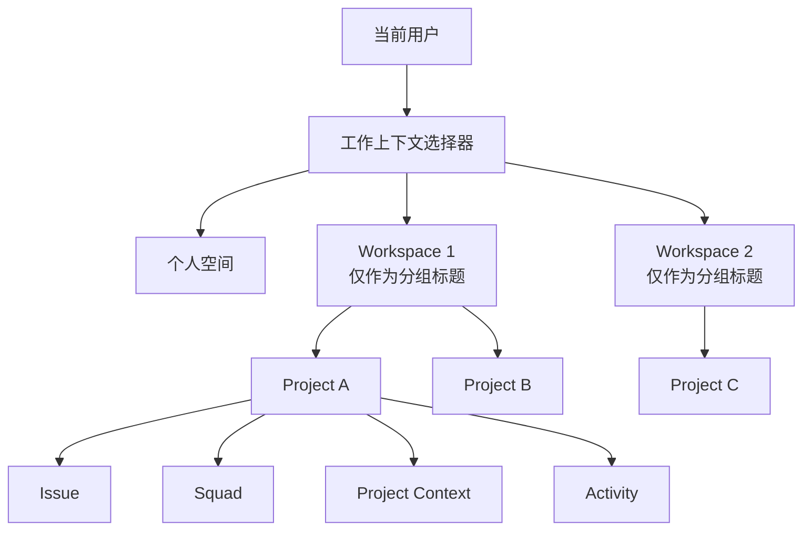
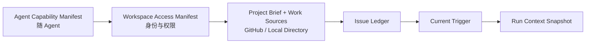
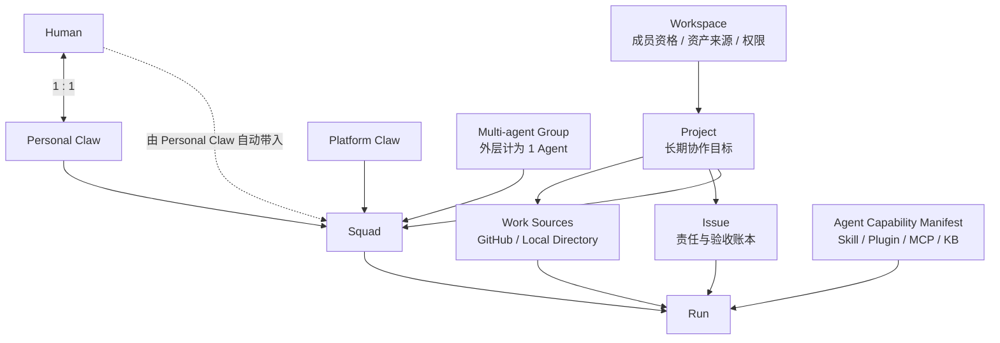

# My Claw 组织协作原型需求变更说明

> 文档类型：需求变更 / Change Request
> 变更编号：`CR-MC-ORG-001`
> 规格日期：2026-07-27
> 适用分支：`feat/my-claw-org-collaboration-prototype`
> 适用代码库：`/Users/nanbunan/Dev-Projects/nexus-platform`
> 基线文档：`2026-07-27-my-claw-organization-collaboration-prototype-prd.md`
> 变更优先级：P0
> 执行规则：本文与基线 PRD 冲突时，以本文为准；本文未涉及的功能继续按基线 PRD 实现

---

## 0. 给 Coding Agent 的强制说明

这不是视觉微调，而是对组织协作原型的对象边界、成员模型、上下文装配机制和导航主路径进行修正。

实现前必须：

1. 先读完本文，再定位代码；
2. 保留当前分支已有未提交改动，不覆盖无关页面；
3. 不删除 Workspace 与 Project 的数据归属关系；
4. 不再把 Workspace 做成用户进入 Project 的必经页面；
5. 不把 Agent 自带的 Skill、插件、MCP、知识库等能力复制到 Project；
6. 不创建 Workspace 级 Issue 或“通用 Issue”；
7. 不把 Human 与其个人 Claw 当成两个互不相关的普通成员；
8. 不把多智能体内部子 Agent 展开为 Squad 成员；
9. 原型交互必须真的可点击、可切换、可创建和可校验，不能只修改静态文案。

本次只要求修改前端原型与 mock 数据，不接真实后端，不扩张 Nexus Platform 的角色、权限、审计和审批能力。

---

## 1. 变更结论

本次形成四个最终结论。

### 1.1 保留 Workspace → Project 的数据层级

Workspace 和 Project 仍然是两个对象：

- Workspace 是组织资产、成员资格和访问范围的边界；
- Project 是 Human 与 Agent 围绕一个长期目标共同工作的协作边界；
- Issue 必须属于一个 Project；
- Run 必须由一个 Project 内的 Issue 或明确的 Project 触发产生。

因此，不合并 Workspace 与 Project。

### 1.2 取消 Workspace-first 的用户导航

保留数据嵌套，不保留逐层点击。

用户从 My Claw 进入某个 Project 时，不再执行：

```text
打开空间选择器
→ 选择 Workspace
→ 进入 Workspace 首页
→ 再选择 Project
```

改为：

```text
打开工作上下文选择器
→ 直接选择 Project
```

Workspace 只作为 Project 的分组、来源和权限边界出现，不再是日常协作的强制中转页。

### 1.3 Project 只绑定工作源，不绑定 Agent 能力

Project 可绑定的 Resource 只允许：

- GitHub Repository；
- Local Directory。

以下能力属于 Agent，自始至终跟随 Agent，不属于 Project：

- Skill；
- 插件；
- MCP；
- 知识库；
- Workflow；
- 数据库连接能力；
- 模型、系统指令和工具策略；
- 多智能体内部的子 Agent 与各自能力。

### 1.4 Squad 以 Agent 为执行成员，Human 由个人 Claw 关系派生

每个人只有一个个人 Agent / 个人 Claw。

例如：

```text
若楠 ←一对一→ 若楠的 Claw
```

当若楠的 Claw 被加入 Squad 时：

- 若楠的 Claw 成为 Squad 的 Agent 成员；
- 若楠本人自动成为该 Squad 的 Human 成员；
- 不允许只加入若楠的 Claw、却不显示若楠；
- 不要求用户再手动添加若楠一次。

Squad 还可以加入nexus平台中的：

- 平台 Claw；
- 多智能体组。

平台 Claw 和多智能体组没有对应的 Human 成员。

每个可用 Squad 必须至少有一个非个人 Claw 的 Agent，因此：

```text
Agent 数 > Human 数
```

多智能体组在 Squad 外层只计为一个 Agent 成员，不展开其内部子 Agent。

---

## 2. 本次变更范围

| 变更项 | 原设计 | 新设计 |
|---|---|---|
| 首要导航对象 | Workspace | 个人空间或具体 Project |
| Workspace 首页 | 进入组织协作的必经页 | 浏览和管理 Project 的次级页 |
| 左上选择器 | Workspace Switcher | Work Context Switcher |
| Project 入口 | 先选 Workspace，再选 Project | 跨 Workspace 直接搜索/选择 Project |
| Project Resource | Claw、Agent、Skill、插件、MCP、知识库等 | GitHub Repository、Local Directory |
| Agent 能力 | 可能被 Project 再绑定 | 始终跟随 Agent |
| Human 与个人 Claw | 两类可独立选择的成员 | 一对一绑定，加入个人 Claw时自动带入 Human |
| Squad 成员数 | Agent 与 Human 无强约束 | Agent 数必须大于 Human 数 |
| 多智能体 | 可加入 Squad | 作为一个完整 Agent 加入，不展开内部成员 |
| Issue 归属 | 可能出现通用或 Workspace 级 Issue | `projectId` 必填，全部属于 Project |
| Workspace 上下文 | 可能被装配为语义上下文 | 仅提供路由、成员资格与权限，不提供业务语义上下文 |

---

## 3. 当前页面问题诊断

### 3.1 当前空间视角

当前 `/my-claw/workspaces/[workspaceId]` 页面同时承担：

- 当前 Workspace 身份展示；
- Workspace 聚合指标；
- Project 搜索；
- Project 卡片列表；
- 创建 Project；
- 最近 Project。

左侧又同时存在：

- 空间首页；
- 项目；
- 最近项目。

其中“空间首页”和“项目”指向同一路由，信息重复。

### 3.2 当前 Project 视角

进入 `/my-claw/workspaces/[workspaceId]/projects/[projectId]` 后：

- 左上选择器仍只展示 Workspace 名称；
- Project 名称在侧栏中再次展示；
- 侧栏提供“返回项目列表”；
- 用户若要切另一个 Workspace 的 Project，要先退回或重新选择 Workspace。

### 3.3 根因

当前实现把底层数据归属直接映射成了用户的页面进入顺序：

```text
Workspace 是 Project 的父对象
≈
用户必须先访问 Workspace 页面，才能访问 Project
```

这两个命题并不等价。

正确关系应是：

```text
数据归属：Workspace → Project
用户目的地：Personal Space | Project
```

Workspace 可以继续负责分组和权限，但 Project 应当成为组织协作中的日常工作入口。

---

## 4. 新信息架构



### 4.1 用户感知层级

用户日常感知的顶层工作上下文只有两类：

1. 个人空间；
2. 具体 Project。

Workspace 不与 Project 并列为同等强度的工作目的地。

### 4.2 数据归属层级

底层数据继续保持：

```text
Organization Workspace
└── Collaboration Project
    ├── Project Brief
    ├── Work Source Bindings
    ├── Issue
    │   ├── Comment
    │   ├── Run
    │   └── Artifact
    ├── Squad
    └── Activity
```

### 4.3 为什么不删除 Workspace

Workspace 仍然承担：

- 判断用户能看到哪些 Project；
- 提供可被 Project 使用的 Claw 和多智能体候选范围；
- 承接组织成员资格；
- 承接组织级资产来源；
- 聚合展示 Project 数、运行中 Agent 数等运营信息；
- 为 Nexus Platform 的空间运营看板提供统计边界。

但 Workspace 不承担：

- Issue 创建和归属；
- 协作 Brief；
- 共享语义上下文；
- Agent Run 的工作目标；
- 项目文件或工作目录的默认注入。

---

## 5. 新导航方案

## 5.1 左上选择器改为“工作上下文选择器”

组件仍可沿用当前文件，但产品语义从 `WorkspaceSwitcher` 改为 `WorkContextSwitcher`。

### 触发器展示

个人空间中：

```text
[个人图标] 个人空间
           仅自己可见
```

Project 中：

```text
[Project 图标] Claw 组织协作机制
               AgentFoundry 研发空间
```

触发器第一行必须展示用户当前真正工作的对象。

在 Project 页面，不得继续只显示 Workspace 名称。

### 选择器内容

选择器结构按以下顺序：

```text
搜索 Project…

个人空间

AgentFoundry 研发空间
  Claw 组织协作机制
  知识库 2.0

科研项目协同空间
  XXXX
```

要求：

- 选择器中只有一套 Project 列表，不再区分“最近 Project”和“全部 Project”；
- “个人空间”直接作为一个独立选项，不再增加“个人”分组标题；
- 所有可见 Project 按所属 Workspace 分组展示；
- Workspace 只显示为分组标题，不可选中，不承担导航目的地；
- Project 名称只显示一层，不再重复显示 Workspace 副标题；
- 搜索对象以 Project 为主，同时可命中 Workspace 名称；
- 搜索 Project 时，结果仍保留所属 Workspace 分组，不改成跨空间的扁平结果列表；
- 搜索命中 Workspace 名称时，显示该 Workspace 下的全部可见 Project；
- 点击 Project 直接进入该 Project，不先进入 Workspace 首页；
- 当前 Project 显示选中状态；
- Workspace 分组采用稳定顺序，不能因为最近访问行为频繁跳动；
- Project 在组内采用稳定顺序，原型阶段沿用 mock 数据顺序；
- 选择器内容超出最大高度时，整个 Project 列表区域滚动；
- 不增加“最近”“全部”“查看全部”“空间概览”等额外入口；
- 没有可见 Project 的 Workspace 不显示空分组；
- 搜索无结果时只显示“未找到 Project”，不引导用户先切换 Workspace。

## 5.2 Workspace 首页退出 My Claw 主导航

保留现有路由：

```text
/my-claw/workspaces/[workspaceId]
```

但它不再是切换到 Workspace 后的强制落地页。

My Claw 的工作上下文选择器和左侧栏均不再提供 Workspace 首页入口。

保留该页面只是为了兼容：

- Nexus Platform 运营看板的 Deep Link；
- 用户直接访问已有 URL。

此页可以继续包含：

- Project 列表；
- 新建 Project；
- Workspace 聚合运营指标；
- 搜索和状态筛选。

此页不得产生 Workspace 级协作上下文，也不得提供 Workspace 级 Issue。

建议将页面标题从“空间首页”语义收敛为：

```text
AgentFoundry 研发空间 · 全部 Project
```

该页面属于低频浏览和运营页面，不影响用户在 My Claw 中直接选择 Project 的主路径。

## 5.3 左侧栏调整

### 个人空间

保持现有个人空间功能，不新增 Issue、Squad 和 Project Context 菜单。

用户通过左上工作上下文选择器直接进入 Project。

### Project

Project 侧栏保留：

- Inbox；
- Project 概览；
- 工作项；
- 小队；
- Project Context；
- 动态。

删除：

- “返回项目列表”作为固定一级导航；
- Project 名称的重复卡片；
- “空间首页”；
- 与“空间首页”指向同一路由的“项目”。

Project 名称和 Workspace 来源已经由左上选择器表达，不需要在侧栏再占一层。

## 5.4 路由策略

本次不强制改造 URL。

继续使用：

```text
/my-claw/workspaces/[workspaceId]/projects/[projectId]
```

原因：

- URL 表达数据归属没有问题；
- 问题在于交互链路，而不是 URL 字符数；
- 直接点击 Project 一样可以一次 Deep Link 到嵌套路由；
- 避免为了视觉扁平化制造第二套 Project 路由。

`/my-claw` 继续是个人空间，避免破坏现有入口。

选择器不根据最近访问行为生成额外分区，也不把最近打开的 Project 自动移动到其他 Workspace 分组之前。

## 5.5 目标操作链路

### 从个人空间进入 Project

```text
点击左上工作上下文选择器
→ 在对应 Workspace 分组下点击 Project
→ 直接进入 Project 概览
```

最多两次点击，不经过 Workspace 首页。

### 从 Project A 切换到 Project B

```text
点击左上工作上下文选择器
→ 点击 Project B
→ 直接进入 Project B
```

Project B 可以属于另一个 Workspace。

---

## 6. Project Resource 模型变更

## 6.1 术语调整

为避免“Resource”继续被理解为 Nexus Platform 中的插件、MCP 和知识库，Project 页面建议使用：

> 工作源 / Work Sources

或：

> 代码仓库与工作目录

Project Context 由以下内容组成：

```text
Project Brief
+ Work Source Bindings
+ Issue Ledger
+ Comments / Artifacts
+ Activity
```

## 6.2 允许绑定的两类工作源

### GitHub Repository

至少包含：

- repository owner/name；
- repository URL；
- 默认 branch；
- 当前 ref 或 branch；
- 可选 subpath；
- 访问级别：只读或读写；
- 连接状态；
- 最近同步时间。

### Local Directory

至少包含：

- 显示名称；
- 本地绝对路径；
- 可选工作子目录；
- 访问级别：只读或读写；
- 当前运行环境是否可访问；
- 最近校验时间。

Local Directory 的生产实现依赖本地运行时、桌面端授权或 Agent 执行节点；Web 前端不能假装天然拥有任意本地目录权限。原型必须展示 `可用 / 不可用 / 待授权` 状态，不能把目录路径当成已成功读取。

## 6.3 禁止绑定到 Project 的资源

Project Context 页面不得再提供以下绑定入口：

- Claw；
- 单 Agent；
- 多智能体；
- Skill；
- 插件；
- MCP；
- Workflow；
- 知识库；
- 数据库。

Claw、平台 Claw和多智能体通过 Project 成员或 Squad 关系进入协作，不是 Project Resource。

Skill、插件、MCP、知识库等通过 Agent Capability Bundle 进入运行时，不是 Project Resource。

## 6.4 建议类型定义

```ts
export type ProjectWorkSourceType =
  | "github_repository"
  | "local_directory";

export type WorkSourceAvailability =
  | "available"
  | "unavailable"
  | "authorization_required";

export interface ProjectWorkSourceBinding {
  id: string;
  workspaceId: string;
  projectId: string;
  type: ProjectWorkSourceType;
  name: string;
  locator: string;
  branch?: string;
  ref?: string;
  subpath?: string;
  access: "read" | "read_write";
  availability: WorkSourceAvailability;
  validatedAt?: string;
  boundAt: string;
}
```

旧的 `ResourceBindingType` 不再允许：

```ts
"claw"
"agent"
"multi_agent"
"skill"
"plugin"
"mcp"
"workflow"
"knowledge_base"
"database"
```

原型可直接将现有 `ProjectResourceBinding` 重命名为 `ProjectWorkSourceBinding`；若为了减小改动保留旧接口名，也必须把联合类型收窄到两类，UI 文案改为“工作源”。

## 6.5 Project 文件与产物边界

不再创建一个独立的“Workspace 共享文件上下文”。

Project 中的文件只来自：

1. 已绑定 GitHub Repository；
2. 已绑定 Local Directory；
3. Issue 附件；
4. Issue / Run 产生的 Artifact。

“最近产物”可以继续展示，但必须能追溯到 Project，以及在适用时追溯到 Issue 和 Run。

---

## 7. Agent Capability 与上下文装配

## 7.1 两种 Manifest 必须分开

旧表述中的 `Workspace Capability Manifest` 容易把组织资产和 Agent 自带能力混成一层。

本次改为两个不同对象。

### Workspace Access Manifest

只包含：

- `workspaceId`；
- `projectId`；
- 当前用户成员资格；
- 当前 Agent 是否允许进入该 Project；
- 可访问范围；
- 可执行/只读权限；
- 可用于校验的 actor allowlist。

它是路由和权限包络，不是语义上下文，不包含 Skill、插件、MCP 和知识库正文。

### Agent Capability Manifest

跟随被选中的 Agent，至少包含：

- Agent / Claw 身份；
- 模型和系统指令；
- Skill；
- 插件；
- MCP；
- 知识库；
- Workflow 或工具策略；
- 凭证引用和权限策略；
- 对多智能体而言，其内部编排与子 Agent 能力引用。

不同 Agent 加入同一个 Project 或 Squad 时，各自保留自己的 Capability Manifest，不互相继承。

## 7.2 Project Run 的输入装配顺序



建议运行时输入结构：

```ts
export interface ProjectRunContext {
  agentCapabilityManifest: {
    actorId: string;
    actorType: "personal_claw" | "platform_claw" | "multi_agent_group";
    capabilityRefs: string[];
    policyRef: string;
  };

  workspaceAccessManifest: {
    workspaceId: string;
    projectId: string;
    userMembershipId?: string;
    actorAllowed: boolean;
    access: "read" | "execute" | "read_write";
  };

  projectContext: {
    brief: string;
    workSources: ProjectWorkSourceBinding[];
  };

  issueLedger: {
    issueId: string;
    title: string;
    description: string;
    acceptanceCriteria: string[];
    status: IssueStatus;
    recentComments: IssueComment[];
    artifactRefs: string[];
  };

  currentTrigger: {
    type: "assignment" | "mention" | "rerun";
    payload: string;
  };

  runSnapshot: {
    runId: string;
    previousRunId?: string;
    selectedFileRefs: string[];
    selectedCommentIds: string[];
  };
}
```

## 7.3 自动注入、按需读取与禁止注入

### 自动装配

- 当前 Agent 的 Capability Manifest；
- Workspace Access Manifest；
- Project Brief；
- Work Source 的元数据和可访问状态；
- 当前 Issue 的标题、描述、验收标准、状态和近期公开评论；
- 当前触发消息；
- 当前 Run Snapshot。

### 按需读取

- GitHub Repository 的具体文件内容；
- Local Directory 的具体文件内容；
- 历史 Issue 评论；
- 历史 Run 日志；
- 大型 Artifact；
- 非当前 Issue 的 Project 历史。

“绑定工作源”不等于把整个仓库或目录全文塞进模型上下文。Agent 应通过文件搜索、目录浏览和读取工具按需获取内容。

### 永不默认注入

- Workspace 下全部 Project 的上下文；
- Workspace 下全部资产；
- 其他 Project 的 Issue、评论和文件；
- 其他 Agent 的 Capability Manifest；
- 其他用户的个人会话、个人文件和个人记忆；
- 未授权凭证；
- GitHub Repository 或 Local Directory 的全量文件正文。

## 7.4 上下文写回

Agent 可写回：

- Issue 评论；
- Run 摘要；
- Artifact；
- Git commit / branch / pull request 引用；
- Local Directory 内被授权的文件修改；
- Activity 事件。

Agent 不应静默改写：

- Project Brief；
- Workspace 成员资格；
- 其他 Agent 的能力配置；
- Human 与个人 Claw 的一对一关系。

Project Brief 的正式修改必须有明确的人类操作或可追踪审批。

---

## 8. Human、个人 Claw 与 Squad 成员模型

## 8.1 一人一 Agent

每个 Human 只能绑定一个 `personal_claw`：

```text
Human 1 ←→ 1 Personal Claw
```

约束：

- `personal_claw.ownerUserId` 必填；
- 同一个 `ownerUserId` 只能对应一个 `personal_claw`；
- 同一个 `personal_claw` 只能对应一个 Human；
- 平台 Claw 和多智能体组不设置 `ownerUserId`；
- 不提供“为同一个 Human 新增第二个个人 Claw”的原型入口。

建议保留现有 `AgentActor.ownerUserId`，并增加校验 helper：

```ts
function getPersonalClawForUser(userId: string): AgentActor | undefined;
function getHumanForPersonalClaw(actorId: string): CollaborationUser | undefined;
```

## 8.2 Squad 存储 Agent，Human 由关系派生

Squad 的执行成员以 AgentActor 为主存储：

```ts
export type SquadAgentActorType =
  | "personal_claw"
  | "platform_claw"
  | "multi_agent_group";

export interface SquadAgentMember {
  actorId: string;
  state: "active" | "pending_consent";
  roleLabel: string;
}

export interface Squad {
  id: string;
  workspaceId: string;
  projectId: string;
  name: string;
  description: string;
  leaderActorId: string;
  agentMembers: SquadAgentMember[];
  status: "ready" | "running" | "degraded";
  activeIssueCount: number;
  updatedAt: string;
}
```

Human 成员不需要重复存储：

```ts
function getDerivedHumanMembers(squad: Squad): CollaborationUser[] {
  return squad.agentMembers
    .map((member) => getActor(member.actorId))
    .filter((actor) => actor?.type === "personal_claw")
    .map((actor) => getUser(actor.ownerUserId));
}
```

如果原型为了 UI 状态必须缓存 Human 列表，缓存只能是派生数据，不得提供独立编辑入口。

## 8.3 加入 Squad 的行为

### 添加自己的个人 Claw

```text
选择“若楠的 Claw”
→ 添加 Agent 成员
→ 自动添加 Human“若楠”
→ 立即 active
```

### 添加他人的个人 Claw

```text
选择“林晓的 Claw”
→ 添加 Agent 成员，状态 pending_consent
→ 自动添加 Human“林晓”，状态同步为待确认
→ 生成个人 Claw consent Inbox 事件
→ 林晓同意后，两者同时 active
```

不得要求 Squad 创建者再手动选择林晓。

### 添加平台 Claw

```text
选择“SRE 值班 Claw”
→ 添加一个 Agent 成员
→ 不增加 Human
```

### 添加多智能体组

```text
选择“产品设计多智能体”
→ 添加一个 Agent 成员
→ 不展开内部子 Agent
→ 不增加 Human
```

## 8.4 删除 Squad 成员

- 删除个人 Claw：同时删除由它派生的 Human 成员展示；
- 删除平台 Claw：只删除该 Agent；
- 删除多智能体组：只删除外层 Agent 引用；
- 不提供“只删除 Human、保留其个人 Claw”的操作；
- 如果被删除成员是 Squad Leader，必须先选择新的 Leader；
- 删除后若不再满足 `agentCount > humanCount`，阻止保存并提示补充至少一个平台 Claw 或多智能体组。

## 8.5 数量口径

```ts
const agentCount = squad.agentMembers.length;
const humanCount = getDerivedHumanMembers(squad).length;
const nonPersonalAgentCount = squad.agentMembers.filter(
  (member) => getActor(member.actorId)?.type !== "personal_claw"
).length;
```

可用 Squad 必须满足：

```ts
agentCount > humanCount;
nonPersonalAgentCount >= 1;
```

Pending consent 的个人 Claw 和对应 Human 在成员总数中都计入，但 Squad 状态应显示 `degraded` 或“待成员确认”，不能开始新的 Squad Run。

## 8.6 Squad UI

### 创建/编辑弹窗

候选项分三组：

1. 个人 Claw；
2. 平台 Claw；
3. 多智能体组。

个人 Claw 候选项必须同时展示：

```text
若楠的 Claw
将同时加入：若楠
```

不得再展示含义重叠的：

- 个人 Claw；
- 同一个 Human；

作为两个可分别勾选的候选。

### Squad 详情

成员展示分两栏：

```text
Human（2）
  若楠 · 由“若楠的 Claw”带入
  林晓 · 由“林晓的 Claw”带入

Agent（4）
  若楠的 Claw · Personal
  林晓的 Claw · Personal
  需求分析 Claw · Platform
  产品设计多智能体 · Multi-agent
```

页面必须清楚解释：

> Human 成员由其个人 Claw 的 Squad 成员关系自动派生。

Squad 卡片上的数量也按该口径显示，不再把 Human 数与 Agent 数混为一个总成员数。

---

## 9. Issue 归属与上下文边界

## 9.1 不新增通用 Issue

本次明确不做：

- Workspace Issue；
- 未归属 Project 的 Issue；
- 个人空间通用 Issue；
- “稍后再选择 Project”的 Issue 草稿；
- Workspace 级写作 Issue。

所有 Issue 必须满足：

```ts
interface Issue {
  workspaceId: string;
  projectId: string; // required
}
```

`projectId` 不允许为空。

## 9.2 创建入口

Issue 只能从以下入口创建：

- Project 概览；
- Project 工作项页面；
- Project 内的评论或 Agent 操作；
- 全局 Inbox 中已明确携带 `projectId` 的事件。

如果未来在全局位置提供“新建 Issue”，第一步必须选择一个 Project，创建动作最终仍发生在 Project 内。本次原型不新增这个全局入口。

## 9.3 Workspace 聚合统计

Workspace 首页可以统计：

- 全部 Project 的活跃 Issue 数；
- 全部 Project 的待验收 Issue 数；
- 按 Project 分组的 Issue 状态。

这只是聚合查询：

```text
SELECT Issue WHERE Issue.project.workspaceId = currentWorkspaceId
```

不代表存在 Workspace 级 Issue，也不构成 Workspace 级共享上下文。

## 9.4 Inbox

Inbox 仍然是个人和组织共用的用户级全局 Inbox。

组织消息必须携带：

- `workspaceId`；
- `projectId`；
- 适用时携带 `issueId`；
- 适用时携带 `commentId` 或 `runId`。

点击后直接 Deep Link 到目标 Project / Issue，不先打开 Workspace 首页。

---

## 10. Mock 数据迁移要求

## 10.1 AgentActor

将原始类别收敛为 Squad 可理解的产品来源：

| 旧类型 | 新类型 / 处理 |
|---|---|
| `personal_claw` | 保留 |
| `managed_claw` | 改为 `platform_claw` |
| `autonomous_agent` | 若产品上以平台 Claw 发布，则迁移为 `platform_claw` |
| `workflow_agent` | 不作为独立 Squad 成员；若确需展示，必须由平台 Claw 封装 |
| `multi_agent` | 改为 `multi_agent_group`，外层计为一个 Agent |

不要仅改 TypeScript 字符串，卡片名称、来源标签和说明文案也要一致。

## 10.2 Human–Personal Claw

检查全部 Human：

- 每个 Human 恰好有一个个人 Claw；
- 每个个人 Claw 恰好有一个 `ownerUserId`；
- 不得出现同一 Human 的第二个个人 Claw；
- 不得出现没有对应 Human 的 `personal_claw`。

## 10.3 Squad

现有示例小队应迁移为：

```text
Human
  林晓
  若楠

Agent
  林晓的 Claw
  若楠的 Claw
  需求分析平台 Claw
  产品设计多智能体
```

此时：

```text
Human = 2
Agent = 4
Agent > Human
```

## 10.4 Project Work Sources

删除 mock 中作为 Project Resource 的：

- Claw；
- Agent；
- 多智能体；
- Skill；
- 插件；
- MCP；
- Workflow；
- 知识库；
- 数据库。

至少准备以下可演示数据：

```text
GitHub Repository
  nexus-platform
  github.com/.../nexus-platform
  branch: feat/my-claw-org-collaboration-prototype
  access: read_write
  availability: available

Local Directory
  Nexus Platform 本地工作目录
  /Users/nanbunan/Dev-Projects/nexus-platform
  access: read_write
  availability: available
```

再准备一个 `authorization_required` 或 `unavailable` 的目录示例，验证状态展示和禁用行为。

## 10.5 Issue

检查全部 Issue：

- 都有有效 `projectId`；
- `workspaceId` 与 Project 的 `workspaceId` 一致；
- Inbox Deep Link 能直接进入对应 Project / Issue；
- 不新增 `general`、`workspace` 或空 Project 的 Issue。

---

## 11. 代码影响面

以下是预期影响范围，Coding Agent 应先读取现有实现再修改，不应照文件名机械重写。

### 11.1 导航

#### `components/my-claw/collaboration/workspace-switcher.tsx`

需要：

- 从 Workspace-first 改为 Project-first；
- 解析并使用当前 `projectId`；
- Project 页面触发器显示 Project 名称；
- 直接读取全部可见 Project，不再调用“最近 Project”作为独立数据源；
- Project 按 Workspace 分组；
- “个人空间”作为独立选项，不显示额外分组标题；
- Workspace 只作为不可选的分组标题；
- 搜索结果继续保留 Workspace 分组；
- 点击 Project 直接 Deep Link；
- 删除“最近 Project”“全部 Project”“查看全部 Project”和“空间概览”入口；
- 列表超高时在选择器内部滚动；
- 建议重命名导出为 `WorkContextSwitcher`，旧名可暂时做兼容导出。

#### `components/my-claw/collaboration/organization-sidebar-content.tsx`

需要：

- 删除固定“返回项目列表”；
- 删除重复的 Project 信息卡；
- 删除 Workspace 视角中同路由的“空间首页 / 项目”双菜单；
- Project 视角仅保留 Project 功能导航；
- 不在 Project 侧栏补充 Workspace 聚合页入口。

#### `components/my-claw/shell/sidebar.tsx`

只做必要接线：

- 保持 Inbox 全局；
- 个人空间现有导航不变；
- 组织 Project 使用新工作上下文选择器；
- 不把所有协作逻辑重新塞进该文件。

### 11.2 数据与状态

#### `lib/mock/my-claw/collaboration/types.ts`

需要：

- 收窄 AgentActor 类型；
- 收窄 Project Work Source 类型；
- 建立 Human–personal Claw 一对一约束；
- Squad 成员改为 Agent 主存储、Human 派生；
- 保证 Issue `projectId` 必填。

#### `lib/mock/my-claw/collaboration/actors.ts`

需要：

- 清理泛化的 autonomous/workflow 类型；
- 补齐一人一 Claw；
- 调整 source label。

#### `lib/mock/my-claw/collaboration/squads.ts`

需要：

- 迁移成员结构；
- 保证 Agent 数大于 Human 数；
- 保留多智能体整体成员。

#### `components/my-claw/collaboration/collaboration-provider.tsx`

需要：

- 增加一对一关系查询 helper；
- 增加 Squad 派生 Human helper；
- 创建/编辑 Squad 时校验 `agentCount > humanCount`；
- 添加个人 Claw 时联动 consent 和 Inbox；
- 绑定工作源时只接受 GitHub / Local Directory；
- 创建 Issue 时强制验证 Project；
- 跨 Workspace 切 Project 时清理上一个 Project 的页面筛选状态，但不清理全局 Inbox。

### 11.3 Project Context

#### `components/my-claw/collaboration/context/project-context-page.tsx`

需要：

- “外层资源引用”改为“工作源”；
- 绑定类型只保留 GitHub Repository / Local Directory；
- 展示可用状态和访问级别；
- 明确 Agent 能力跟随 Agent；
- 保留 Brief、Artifact 和工作文件，但不再展示平台资产绑定。

### 11.4 Squad

#### `components/my-claw/collaboration/squads/*`

需要：

- 候选项改为个人 Claw / 平台 Claw / 多智能体组；
- 个人 Claw 展示对应 Human；
- 详情页分栏展示 Human 与 Agent；
- 删除个人 Claw 时同步移除派生 Human；
- 不允许只有个人 Claw 的 Squad；
- 不展开多智能体内部 Agent。

### 11.5 Workspace 首页

#### `components/my-claw/collaboration/workspace-home.tsx`

保留但降级为次级页：

- 标题强化“全部 Project”；
- 聚合指标明确是跨 Project 统计；
- 不提供 Workspace 级 Issue 创建；
- Project 卡片直接进入 Project；
- 页面不承担上下文选择器的中转职责。

---

## 12. 状态规则与异常处理

## 12.1 Project 不可访问

如果选择器中的 Project 已被移除权限：

- 不进入空白页；
- 从所属 Workspace 分组移除；
- 提示“你已无法访问该 Project”；
- 保持在当前工作上下文。

## 12.2 Local Directory 不可用

如果目录不可用：

- Work Source 显示不可用状态；
- Agent 运行前展示阻塞原因；
- 不伪造文件内容；
- 允许用户重新授权或移除绑定；
- 其他可用 Work Source 仍可继续使用。

## 12.3 Agent Capability 不可用

某 Agent 的插件、MCP 或知识库不可用时：

- 这是 Agent Capability 的状态；
- 不将故障转化为 Project Resource 丢失；
- Squad 页面显示对应 Agent degraded；
- 不影响其他 Agent 使用各自能力。

## 12.4 Human consent 未完成

他人的个人 Claw处于 `pending_consent` 时：

- 对应 Human 同步显示待确认；
- Squad 状态为 degraded 或待确认；
- 不允许启动新的 Squad Run；
- 同意后两者同时 active；
- 拒绝后同时从 Squad 移除。

## 12.5 Project 跨 Workspace 切换

切换时必须：

- 更新当前 Project；
- 更新触发器中的 Project 名称与 Workspace 来源；
- 更新 Project 侧栏；
- 清理旧 Project 的筛选、弹窗和临时选择；
- 保留用户级 Inbox 未读数；
- 不显示上一个 Workspace 的 Project 内容。

---

## 13. 验收标准

## 13.1 导航

- [ ] 个人空间进入任一 Project 最多两次点击。
- [ ] 切换器中可以直接选择另一个 Workspace 的 Project。
- [ ] 点击 Project 不经过 Workspace 首页。
- [ ] Project 页面左上第一行显示 Project 名称，第二行显示 Workspace。
- [ ] “个人空间”直接显示为独立选项，没有“个人”分组标题。
- [ ] Project 只按 Workspace 分组，不区分“最近”和“全部”。
- [ ] Workspace 分组标题不可选，不进入 Workspace 首页。
- [ ] Project 在 Workspace 分组下只显示一层名称，不重复 Workspace 副标题。
- [ ] 搜索可以命中全部可见 Project 和 Workspace 名称。
- [ ] 搜索结果仍按 Workspace 分组。
- [ ] 选择器中没有“查看全部 Project”或“空间概览”入口。
- [ ] Project 页面不再出现固定“返回项目列表”。
- [ ] 不再出现同一路由的“空间首页”和“项目”两个菜单。
- [ ] `/my-claw` 的个人空间已有功能不受影响。
- [ ] 现有嵌套 Project URL 仍可直接打开。

## 13.2 Project Work Sources

- [ ] Project 只能绑定 GitHub Repository 或 Local Directory。
- [ ] Project Context 不再展示 Skill、插件、MCP、知识库等绑定入口。
- [ ] GitHub 绑定显示 URL、branch/ref、权限和连接状态。
- [ ] Local Directory 显示路径、权限和可用状态。
- [ ] 不可用目录不会被当作已读取。
- [ ] Artifact 能追溯到 Project，并在适用时追溯到 Issue / Run。

## 13.3 Agent Capability

- [ ] 每个 Agent 保留自己的 Skill、插件、MCP、知识库等能力。
- [ ] 同一 Squad 中的 Agent 不互相继承能力。
- [ ] Project 不复制或覆盖 Agent Capability。
- [ ] Workspace Access Manifest 只表达身份、范围与权限。
- [ ] 绑定仓库/目录不会自动把全量文件正文注入上下文。

## 13.4 Human–Claw–Squad

- [ ] 每个 Human 恰好有一个个人 Claw。
- [ ] 添加个人 Claw 时自动显示对应 Human。
- [ ] 不存在“只在 Squad 中保留个人 Claw、隐藏其 Human”的状态。
- [ ] 添加平台 Claw 不增加 Human。
- [ ] 添加多智能体组只增加一个 Agent，不展开内部子 Agent。
- [ ] 任一可用 Squad 均满足 `Agent 数 > Human 数`。
- [ ] 只有个人 Claw 的 Squad 无法保存或运行。
- [ ] 删除个人 Claw 会同步移除派生 Human。
- [ ] 他人的个人 Claw consent 状态与对应 Human 同步。
- [ ] Squad 详情分开显示 Human 数和 Agent 数。

## 13.5 Issue

- [ ] 所有 Issue 都有有效 `projectId`。
- [ ] 没有 Workspace 级、个人空间级或通用 Issue。
- [ ] Workspace 活跃 Issue 数只是 Project Issue 聚合。
- [ ] Inbox 组织消息直接 Deep Link 到 Project / Issue。
- [ ] Run completed 仍不自动等于 Issue done。

## 13.6 回归

- [ ] TypeScript 编译通过。
- [ ] 目标文件 ESLint 通过。
- [ ] 个人会话、Agent 广场、Skill、插件、自动化、文件和设置仍可访问。
- [ ] 全局 Inbox 未读数在跨 Project 切换后保持一致。
- [ ] 页面刷新后嵌套 Project 路由仍能恢复正确上下文。
- [ ] Workspace A 与 Workspace B 的 Project 数据不会串线。

---

## 14. 必测演示脚本

### 场景 A：从个人空间直接进入 Project

1. 打开 `/my-claw`；
2. 点击左上工作上下文选择器；
3. 选择“Claw 组织协作机制”；
4. 验证直接进入 Project 概览；
5. 验证没有先进入 Workspace 首页；
6. 验证触发器显示 Project 名和 Workspace 名。

### 场景 B：跨 Workspace 切 Project

1. 当前位于 AgentFoundry 的 Project；
2. 打开工作上下文选择器；
3. 搜索科研 Project；
4. 点击搜索结果；
5. 验证直接进入科研 Project；
6. 验证侧栏、Issue、Squad 和 Context 全部切换；
7. 验证 Inbox 未读数不变。

### 场景 C：绑定工作源

1. 进入 Project Context；
2. 点击“绑定工作源”；
3. 验证只有 GitHub Repository 和 Local Directory；
4. 绑定 GitHub Repository；
5. 验证 branch、权限、可用状态；
6. 绑定一个待授权 Local Directory；
7. 验证 Agent Run 不会假装读取该目录。

### 场景 D：创建 Squad

1. 新建 Squad；
2. 添加“若楠的 Claw”；
3. 验证 Human“若楠”自动出现；
4. 尝试只保存该成员；
5. 验证因 Agent 数不大于 Human 数而阻止保存；
6. 添加“产品设计多智能体”；
7. 验证 Agent = 2、Human = 1；
8. 保存成功；
9. 验证多智能体内部子 Agent 未展开。

### 场景 E：添加他人的个人 Claw

1. 编辑 Squad；
2. 添加“林晓的 Claw”；
3. 验证“林晓”同步出现；
4. 验证两者状态均为待确认；
5. 在全局 Inbox 完成确认；
6. 验证两者同时 active。

### 场景 F：验证无通用 Issue

1. 检查个人空间；
2. 检查 Workspace 首页；
3. 验证两处均无通用 Issue 创建入口；
4. 在 Project 中创建 Issue；
5. 验证 Issue 带有当前 `projectId`；
6. 从 Inbox 点击该 Issue；
7. 验证直接进入对应 Project / Issue。

---

## 15. 非目标

本次不做：

- 删除 Workspace；
- 将 Workspace 与 Project 合并；
- 新增扁平 `/my-claw/projects/[projectId]` 路由；
- 真实 GitHub OAuth；
- 真实本地目录授权；
- 真实 Agent Runtime 上下文装配；
- Workspace 级 Issue；
- 通用 Issue；
- 个人空间 Issue；
- Squad 嵌套；
- 多智能体内部成员编辑；
- Agent Capability 的创建或配置改版；
- Nexus Platform 成员、权限、审计和审批系统；
- 真实后端数据迁移。

---

## 16. 最终产品定义

一句话定义：

> My Claw 的 Workspace 是组织资产与访问范围，Project 是 Human 与 Agent 的共同工作上下文；用户可以直接选择 Project 开始工作，而不必先“进入 Workspace”。Project 只绑定 GitHub 仓库或本地目录，Agent 的 Skill、插件、MCP 和知识库始终跟随 Agent。每个人只有一个个人 Claw，个人 Claw进入 Squad 时对应 Human 自动进入，平台 Claw和多智能体组则作为额外 Agent 成员，使可用 Squad 始终满足 Agent 数大于 Human 数。

最终运行关系：



这套变更同时保留了 Workspace 的组织治理价值和 Project 的协作上下文价值，但取消了二者在界面上的强制逐层进入关系。
