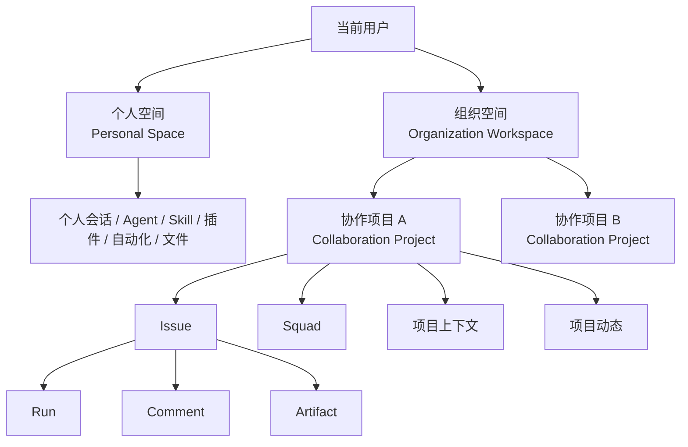
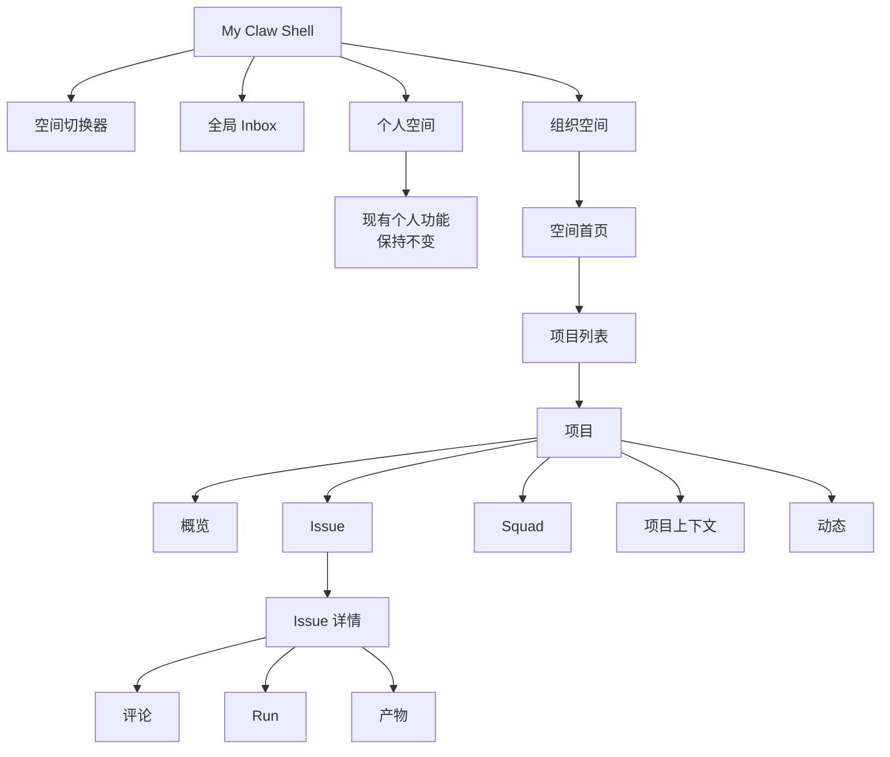
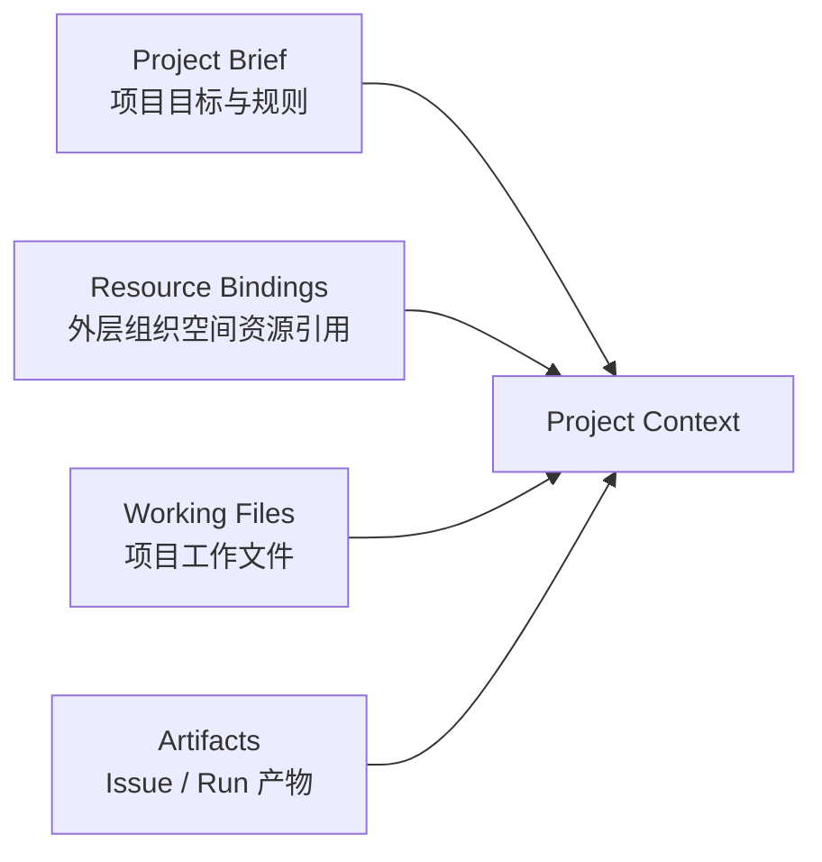

# My Claw 组织协作原型产品规格

> 文档用途：交给 Coding Agent 直接实现完整前端原型
> 适用代码库：`/Users/nanbunan/Dev-Projects/nexus-platform`
> 产品范围：Nexus Platform「空间运营」最小扩展 + My Claw 组织协作使用端
> 规格日期：2026-07-27
> 参考调研：`/Users/nanbunan/个人/Unlimited Progress/raw/产品调研/Agent in Org. for collaboration/Multica调研.md`
> 重要：本文覆盖并修正 `2026-07-27-organization-collaboration-product-design.md` 中关于 Project、Agent 与 Squad 的旧定义
> 变更控制：实现前还必须阅读 `2026-07-27-my-claw-org-collaboration-requirement-change.md`；两份文档冲突时，以需求变更文档为准

---

## 0. 给 Coding Agent 的执行要求

这是一个跨多个页面、多个对象和多条交互链路的原型项目。实现时必须先读完本文，再开始改代码。

### 0.1 必须遵守

1. 先运行 `git status --short`，保留用户已有改动，不覆盖无关工作。
2. 先读现有 My Claw 迁移规格与相关组件，禁止另起一套视觉和页面壳。
3. 个人空间已有功能必须保持可用，不得为了组织协作重写会话、Agent 广场、Skill、插件、自动化、文件和设置。
4. Nexus Platform 只做两个运营看板，不扩张角色、权限、审计等基础管控能力。
5. “多智能体”是现有 Agent 类型，不得改名为 Squad，不得把其内部成员拆到 Squad UI。
6. Squad 是新的组合对象，可以包含个人 Claw、管控端 Claw、单智能体和多智能体。
7. 外层组织空间与内层协作项目必须是两个对象，不能合并。
8. Inbox 是用户级全局对象，不能放进某一个 Project。
9. Issue 的业务状态与 Run 的进程状态必须分开呈现。
10. 原型必须使用真实可操作的 mock 数据与状态变化，不能只画静态空壳。

### 0.2 明确禁止

- 不接真实后端。
- 不重构 Nexus 全局 Header、Dashboard Layout 或 My Claw 三栏会话底座。
- 不修改现有 Claw、智能体、多智能体的创建和配置机制。
- 不在 Nexus Platform 新做成员、角色、权限、审批、审计管理。
- 不把组织协作塞进现有 `/agent` 或 `/claw-hub-next` 页面。
- 不让 Squad 包含另一个 Squad，避免循环嵌套。
- 不让切换组织空间后仍残留上一个空间的 Project、Issue 或文件数据。
- 不把 Run completed 自动显示为 Issue done。
- 不用一个超大组件承载全部页面和状态。
- 不复制旧静态原型的 DOM/CSS；继续使用 Nexus 当前组件、颜色、字号和间距。

---

## 1. 产品结论

本方案采用两层工作空间和一层协作项目：



### 1.1 外层：组织空间

组织空间对应 Nexus Platform 当前已经存在的“组织下的 Project 空间”概念。

为了避免它与 Multica 式 Project 重名，本文统一将这个外层对象称为：

> **组织空间 / Organization Workspace**

组织空间拥有或承载：

- Claw；
- 智能体；
- 多智能体；
- Skill；
- 插件、MCP、OpenAPI、Workflow；
- 知识库；
- 数据库；
- API Key；
- 其他平台资源。

这些资产仍然由 Nexus Platform 及基础管控平台负责创建、发布和治理。

### 1.2 内层：协作项目

组织空间内新增的 Multica 式 Project，本文统一称为：

> **协作项目 / Collaboration Project**

面向用户的 UI 可直接显示“项目”，代码与类型中使用 `CollaborationProject`，避免与外层空间混淆。

协作项目负责：

- 组织一群 Human、Agent 和 Squad 围绕同一目标工作；
- 保存项目说明和公共上下文；
- 从外层组织空间绑定可用资源；
- 管理 Issue；
- 保存评论、Run、工作文件和交付产物；
- 汇总项目动态。

### 1.3 个人空间

个人空间继续使用当前 My Claw 的功能模型：

- 新建会话；
- 最近会话；
- 智能体广场；
- Skill；
- 插件；
- 自动化；
- 文件；
- Claw 配置；
- 产品说明。

本期除以下两项外，不改变个人空间：

1. 增加组织空间切换器；
2. 增加全局 Inbox 入口。

### 1.4 统一 Inbox

Inbox 属于“当前用户”，不属于个人空间、组织空间或某个 Project。

它聚合：

- 个人空间通知；
- 所有组织空间的项目通知；
- Issue 指派；
- `@mention`；
- 待验收；
- Agent / Squad Run 完成或失败；
- Squad 邀请和个人 Claw 入队确认。

### 1.5 Agent 与 Squad

Agent 是一个统一的“可执行协作成员协议”，不是某一个现有产品类型。

以下对象都实现 `AgentActor`：

| 类型 | 来源 | 是否可以加入 Squad | 说明 |
|---|---|---:|---|
| `personal_claw` | 不同用户的个人 Claw | 是 | 默认私有；加入 Squad 需要所属用户确认 |
| `managed_claw` | Nexus Claw 管理 | 是 | 组织侧发布、配置和运行的 Claw |
| `autonomous_agent` | Nexus 自主规划智能体 | 是 | 单体 Agent |
| `workflow_agent` | Nexus 工作流智能体 | 是 | 单体 Agent |
| `multi_agent` | Nexus 多智能体 | 是 | 本身仍被视为一个完整 Agent |

Squad 是这些 AgentActor 的组合：

- 至少两个成员；
- 必须指定一个 Leader；
- Leader 也是 Squad 成员；
- 不允许嵌套 Squad；
- 不展开 `multi_agent` 的内部编排；
- 一个 AgentActor 可以参加多个 Squad；
- Squad 本期属于一个协作项目，不做跨项目复用模板。

---

## 2. 术语冻结

Coding Agent 实现时必须使用下表，不要自行替换概念：

| 产品中文 | 代码名称 | 含义 |
|---|---|---|
| 个人空间 | `PersonalSpace` | 当前用户私有工作空间 |
| 组织空间 | `OrganizationWorkspace` | 对应当前平台外层 Project 资产空间 |
| 项目 | `CollaborationProject` | 组织空间内的人机协作项目 |
| 工作项 | `Issue` | 长期业务责任与协作账本 |
| 执行 | `Run` | 一次 Agent 或 Squad 执行 |
| 小队 | `Squad` | 多种 AgentActor 的项目内组合 |
| 协作成员 | `ProjectMember` | Human 或 AgentActor |
| 项目上下文 | `ProjectContext` | 项目说明、资源引用、工作文件和产物 |
| 收件箱 | `Inbox` | 当前用户跨空间的通知与待办聚合 |

### 2.1 不使用的错误映射

| 错误映射 | 为什么错误 |
|---|---|
| 多智能体 = Squad | 多智能体是已存在的一个 Agent 产品类型；Squad 是多个 AgentActor 的组合 |
| 平台 Project = 协作 Project | 前者是资产和权限空间，后者是人机共同工作的长期协作对象 |
| Project 文件 = Nexus 资产副本 | 项目只能引用外层资产；不得复制出第二套 Skill、插件、知识库或数据库 |
| Inbox = 某个项目通知列表 | Inbox 必须跨个人空间和所有组织空间 |
| Run completed = Issue done | 执行进程结束不代表业务验收完成 |

---

## 3. 范围与非范围

## 3.1 本期必须完成

### My Claw

- 组织空间切换器；
- 全局 Inbox；
- 组织空间首页和项目列表；
- 项目创建；
- 项目概览；
- Issue 列表与看板；
- Issue 详情；
- Issue 评论与 `@Agent`；
- Human / AgentActor / Squad 指派；
- Run 展示、完成、失败和重跑；
- Squad 列表、创建、详情；
- 项目上下文；
- 项目动态；
- 完整 mock 数据和可见状态变化。

### Nexus Platform

- 空间运营新增 Agent 看板；
- 空间运营新增 Squad 看板；
- 两个看板支持搜索、筛选、详情查看；
- 不增加新的治理配置流程。

## 3.2 本期不做

- 真实登录、组织和权限接口；
- 真实 Agent 执行；
- 真实消息推送；
- 真实文件上传和下载；
- 真实资源挂载；
- 真实审批与审计；
- Squad 嵌套；
- 跨组织空间 Squad；
- 项目模板；
- Issue 依赖图；
- Stage；
- 自动化创建 Issue；
- 复杂工作流画布；
- 私聊转 Issue；
- 移动端适配。

---

## 4. 现有实现与改动边界

## 4.1 必须保留的现有路径

| 路径 | 要求 |
|---|---|
| `/my-claw` | 继续默认进入个人空间新会话 |
| `/my-claw/chat` | 保留现有会话能力 |
| `/my-claw/agents` | 保留智能体广场 |
| `/my-claw/skills` | 保留 Skill 页面 |
| `/my-claw/plugins` | 保留插件页面 |
| `/my-claw/automation` | 保留自动化 |
| `/my-claw/files` | 保留个人文件 |
| `/my-claw/settings` | 保留 Claw 配置 |
| `/my-claw/product` | 保留产品说明 |
| `/space-operations/*` | 保留现有所有 Tab 和页面 |

## 4.2 重点复用文件

Coding Agent 开工前必须阅读：

- `docs/superpowers/specs/2026-07-26-my-claw-migration-design.md`
- `components/my-claw/shell/my-claw-shell.tsx`
- `components/my-claw/shell/sidebar.tsx`
- `components/my-claw/shell/nav-items.ts`
- `components/my-claw/shell/session-list.tsx`
- `components/my-claw/provider.tsx`
- `lib/mock/my-claw/types.ts`
- `app/(dashboard)/layout.tsx`
- `lib/space-operations.ts`
- `components/space-operations/space-operations-tab-nav.tsx`
- `app/(dashboard)/agent/page.tsx`
- `lib/published-multi-agents.ts`
- `lib/mock/claw-hub-next.ts`

## 4.3 已存在的未提交改动

编写本文时，以下文件存在用户改动：

- `components/my-claw/plugins/plugins-plaza.tsx`
- `components/my-claw/shell/session-list.tsx`
- `lib/mock/my-claw/plugins.ts`

实现时必须重新检查状态。若仍有改动：

- 不覆盖插件相关文件；
- `session-list.tsx` 如需接入空间切换，先阅读差异；
- 优先通过新组件和新 Provider 扩展，不整文件重写。

---

## 5. 信息架构



### 5.1 My Claw 新增路由

| 路由 | 页面 |
|---|---|
| `/my-claw/inbox` | 全局 Inbox |
| `/my-claw/workspaces/[workspaceId]` | 组织空间首页 / 项目目录 |
| `/my-claw/workspaces/[workspaceId]/projects/[projectId]` | 项目概览 |
| `/my-claw/workspaces/[workspaceId]/projects/[projectId]/issues` | Issue 列表与 Board |
| `/my-claw/workspaces/[workspaceId]/projects/[projectId]/issues/[issueId]` | Issue 详情 |
| `/my-claw/workspaces/[workspaceId]/projects/[projectId]/squads` | Squad 列表 |
| `/my-claw/workspaces/[workspaceId]/projects/[projectId]/squads/[squadId]` | Squad 详情 |
| `/my-claw/workspaces/[workspaceId]/projects/[projectId]/context` | 项目上下文 |
| `/my-claw/workspaces/[workspaceId]/projects/[projectId]/activity` | 项目动态 |

### 5.2 Nexus 新增路由

| 路由 | 页面 |
|---|---|
| `/space-operations/agents` | Agent 运营看板 |
| `/space-operations/squads` | Squad 运营看板 |

在 `SPACE_OPERATIONS_TABS` 中新增：

```ts
{ segment: "agents", label: "Agent 看板" }
{ segment: "squads", label: "Squad 看板" }
```

不要删除、重命名或重排现有 Tab。

---

## 6. 核心数据模型

类型可以根据代码风格拆文件，但语义必须保持。

```ts
export type WorkspaceKind = "personal" | "organization";

export interface PersonalSpace {
  id: "personal";
  kind: "personal";
  name: string;
  ownerUserId: string;
}

export interface OrganizationWorkspace {
  id: string;
  kind: "organization";
  name: string;
  description: string;
  organizationName: string;
  projectCount: number;
  actorCount: number;
}
```

```ts
export interface CollaborationProject {
  id: string;
  workspaceId: string;
  name: string;
  description: string;
  status: "active" | "archived";
  leadUserId: string;
  memberIds: string[];
  actorIds: string[];
  squadIds: string[];
  contextBrief: string;
  createdAt: string;
  updatedAt: string;
}
```

```ts
export type AgentActorType =
  | "personal_claw"
  | "managed_claw"
  | "autonomous_agent"
  | "workflow_agent"
  | "multi_agent";

export type ActorRuntimeStatus =
  | "online"
  | "busy"
  | "offline"
  | "error";

export interface AgentActor {
  id: string;
  workspaceId: string;
  type: AgentActorType;
  name: string;
  description: string;
  avatar?: string;
  ownerUserId?: string;
  sourceLabel: string;
  runtimeStatus: ActorRuntimeStatus;
  activeRunCount: number;
  lastActiveAt: string;
}
```

```ts
export type SquadMemberState = "active" | "pending_consent";

export interface SquadMember {
  actorId: string;
  state: SquadMemberState;
  roleLabel: string;
}

export interface Squad {
  id: string;
  workspaceId: string;
  projectId: string;
  name: string;
  description: string;
  leaderActorId: string;
  members: SquadMember[];
  status: "ready" | "running" | "degraded";
  activeIssueCount: number;
  updatedAt: string;
}
```

```ts
export type IssueStatus =
  | "backlog"
  | "todo"
  | "in_progress"
  | "in_review"
  | "done"
  | "blocked"
  | "cancelled";

export type IssuePriority = "urgent" | "high" | "medium" | "low";

export type ExecutorRef =
  | { kind: "human"; id: string }
  | { kind: "agent"; id: string }
  | { kind: "squad"; id: string };

export interface Issue {
  id: string;
  key: string;
  workspaceId: string;
  projectId: string;
  title: string;
  description: string;
  acceptanceCriteria: string[];
  status: IssueStatus;
  priority: IssuePriority;
  ownerUserId: string;
  executor: ExecutorRef | null;
  reviewerUserId: string | null;
  commentIds: string[];
  runIds: string[];
  artifactIds: string[];
  createdAt: string;
  updatedAt: string;
}
```

```ts
export type RunStatus =
  | "queued"
  | "running"
  | "completed"
  | "failed"
  | "cancelled";

export interface Run {
  id: string;
  workspaceId: string;
  projectId: string;
  issueId: string;
  executor: ExecutorRef;
  status: RunStatus;
  triggerType: "assignment" | "mention" | "rerun";
  startedAt?: string;
  completedAt?: string;
  summary: string;
  errorMessage?: string;
  childRuns?: {
    actorId: string;
    status: RunStatus;
    summary: string;
  }[];
}
```

```ts
export interface IssueComment {
  id: string;
  issueId: string;
  author:
    | { kind: "human"; id: string }
    | { kind: "agent"; id: string }
    | { kind: "system"; id: "system" };
  content: string;
  mentionedActorIds: string[];
  createdAt: string;
}

export interface ProjectArtifact {
  id: string;
  projectId: string;
  issueId?: string;
  runId?: string;
  name: string;
  kind: "file" | "report" | "link" | "pull_request";
  createdByLabel: string;
  createdAt: string;
}
```

```ts
export type ResourceBindingType =
  | "claw"
  | "agent"
  | "multi_agent"
  | "skill"
  | "plugin"
  | "mcp"
  | "workflow"
  | "knowledge_base"
  | "database";

export interface ProjectResourceBinding {
  id: string;
  workspaceId: string;
  projectId: string;
  resourceType: ResourceBindingType;
  resourceId: string;
  name: string;
  sourcePathLabel: string;
  access: "read" | "execute" | "read_write";
  boundAt: string;
}

export interface ProjectWorkingFile {
  id: string;
  workspaceId: string;
  projectId: string;
  name: string;
  path: string;
  sizeLabel: string;
  updatedByLabel: string;
  updatedAt: string;
}
```

```ts
export type InboxEventType =
  | "issue_assigned"
  | "mentioned"
  | "review_requested"
  | "run_completed"
  | "run_failed"
  | "squad_invitation"
  | "personal_claw_consent"
  | "project_update";

export interface InboxItem {
  id: string;
  userId: string;
  type: InboxEventType;
  title: string;
  summary: string;
  unread: boolean;
  source:
    | { kind: "personal"; label: string }
    | {
        kind: "project";
        workspaceId: string;
        workspaceName: string;
        projectId: string;
        projectName: string;
        issueId?: string;
      };
  createdAt: string;
}
```

---

## 7. My Claw Shell 改造

## 7.1 总体布局

继续保留：

- 左侧栏宽度 `272px`；
- 中间主内容区；
- 现有个人会话页面的三栏结构；
- `#2773ff` 主色和当前 Slate 色阶；
- 现有圆角、边框和字体节奏。

不为项目模式新建另一套全屏壳。

## 7.2 左侧栏顺序

左栏固定顺序：

1. My Claw 品牌；
2. 组织空间切换器；
3. 全局 Inbox；
4. 当前空间导航；
5. 当前空间的最近内容；
6. 用户头像与设置。

### 7.2.1 组织空间切换器

位置：当前品牌区下方、搜索框上方。

默认状态：

- 个人空间显示用户头像、`个人空间`、`仅自己可见`；
- 组织空间显示空间图标、空间名称、所属组织。

展开 Popover：

- 宽度约 `320px`；
- 顶部搜索框；
- 第一组固定为“个人空间”；
- 第二组为“组织空间”；
- 每个组织空间显示项目数与 Agent 数；
- 当前项显示 Check；
- 支持点击切换；
- 最近协作项目可作为组织空间项下的二级快捷入口；
- 不在选择器里做新建组织空间。

切换行为：

- 选个人空间：导航到 `/my-claw`；
- 选组织空间：导航到 `/my-claw/workspaces/[workspaceId]`；
- 选最近项目：导航到项目概览；
- 路由是当前上下文的唯一真相，不只用 React state 记忆；
- 切换后不得显示上一个空间的项目和 Issue。

### 7.2.2 全局 Inbox 入口

Inbox 位于切换器下面，任何空间都显示。

入口包含：

- Inbox 图标；
- 文案 `收件箱`；
- 未读数字 Badge；
- 当前路由激活态。

Inbox 不因切换空间而改变未读数量。

### 7.2.3 个人空间导航

保持当前：

- 新建会话；
- 智能体广场；
- Skill；
- 插件；
- 自动化任务；
- 会话列表；
- 设置菜单。

不要把 Issue、Squad、项目上下文插入个人空间导航。

### 7.2.4 组织空间导航

未进入具体项目时：

- 空间首页；
- 项目；
- 最近项目列表。

进入具体项目后：

- 返回项目列表；
- 项目概览；
- Issue；
- Squad；
- 项目上下文；
- 动态。

项目标题显示在导航组头部，过长截断，Hover 展示完整名称。

---

## 8. 全局 Inbox

## 8.1 页面目标

让用户在一个地方处理来自个人空间和所有组织项目的协作通知，不需要逐个切换 Project 查找待办。

## 8.2 页面结构

顶部：

- 标题 `收件箱`；
- 未读数量；
- `全部标为已读`；
- 刷新按钮。

左侧筛选或顶部 Tabs：

- 全部；
- 分配给我；
- @我的；
- 待我验收；
- Agent 结果；
- 小队邀请。

主列表：

- 未读项使用浅蓝背景或左侧蓝点；
- 图标区分事件类型；
- 标题；
- 一行摘要；
- 来源面包屑；
- 相对时间；
- 单项已读 / 未读操作。

来源面包屑示例：

- `个人空间`
- `AgentFoundry 研发空间 / Claw 组织协作 / AGE-12`

## 8.3 点击行为

- 个人通知进入对应个人页面；
- Project 通知自动导航到对应 Workspace / Project / Issue；
- 点击即标记已读；
- 用户不必先手动切换空间；
- 若目标已不存在，显示 Toast：`目标已归档或不可访问`，但仍将该通知标记为已读。

## 8.4 Inbox 与 Agent 的边界

Human 使用 Inbox。

Agent 不读取 Inbox，Agent 只由以下事件触发：

- 被设置为 Issue Executor；
- 评论中被 `@`；
- Squad Leader 收到 Squad Issue；
- 用户手动重跑。

---

## 9. 组织空间首页

路由：`/my-claw/workspaces/[workspaceId]`

## 9.1 页面目标

表示用户已经进入外层平台空间，但尚未进入某个协作 Project。

## 9.2 页面内容

顶部：

- 空间名称；
- 所属组织；
- 描述；
- `新建项目` 主按钮。

概览卡：

- 协作项目数；
- 活跃 Issue；
- 运行中 Agent；
- Squad 数；
- 待当前用户验收数。

项目区域：

- 最近项目；
- 全部项目；
- 搜索；
- 状态筛选；
- 卡片 / 表格视图可只实现一种，建议卡片。

项目卡片：

- 项目名称；
- 简述；
- Project Lead；
- Human / Agent / Squad 数量；
- Issue 状态摘要；
- 最近更新时间；
- 点击进入项目。

## 9.3 新建项目

Dialog 字段：

- 项目名称，必填；
- 项目说明，必填；
- Project Lead，默认当前用户；
- 初始 Human 成员，多选；
- 初始 AgentActor，多选；
- 项目上下文 Brief，可选。

不在创建 Dialog 中配置 Skill、插件、知识库和数据库。项目创建后在“项目上下文”中绑定。

创建后：

- 写入前端状态；
- Toast `项目已创建`；
- 自动进入项目概览；
- 项目出现在空间首页与选择器最近项目中。

---

## 10. 项目概览

路由：`/my-claw/workspaces/[workspaceId]/projects/[projectId]`

## 10.1 页面头部

- 项目名称；
- 描述；
- 状态；
- Project Lead；
- Human、Agent、Squad 头像组；
- `新建 Issue`；
- `项目设置` 次按钮，仅展示 mock Dialog。

## 10.2 首页模块

### 我的工作

- 分配给我的 Issue；
- 待我验收；
- @我的未读讨论。

### Issue 概览

- Todo；
- In Progress；
- In Review；
- Blocked；
- Done。

点击数字进入带对应筛选的 Issue 页面。

### Agent 与 Squad 运行状态

- Running；
- Queued；
- Failed；
- Offline / Degraded。

### 最近产物

- 文件名；
- 关联 Issue；
- 产出者；
- 时间。

### 最近动态

- Issue 状态变化；
- 评论；
- Run；
- Squad 成员变化；
- 资源绑定。

---

## 11. Issue 列表与 Board

路由：`.../issues`

## 11.1 顶部工具栏

- 标题 `工作项`；
- List / Board 切换；
- 搜索；
- 状态；
- 优先级；
- Owner；
- Executor 类型；
- `新建 Issue`。

## 11.2 List

列：

- Key；
- 标题；
- 业务状态；
- 优先级；
- Owner；
- Executor；
- 最近 Run；
- 更新时间。

必须同时显示 Issue 状态和最近 Run 状态，不能合并为一个 Badge。

## 11.3 Board

列：

- Backlog；
- Todo；
- In Progress；
- In Review；
- Done。

Blocked 和 Cancelled 通过筛选查看，不占主 Board 列。

卡片：

- Key；
- 标题；
- 优先级；
- Owner；
- Executor；
- 最近 Run 状态；
- 评论数；
- 产物数。

支持拖拽不是本期硬要求。若不实现拖拽，卡片点击进入详情，状态通过详情页下拉修改。

## 11.4 新建 Issue

Dialog：

- 标题；
- 描述；
- 验收标准，可增删多条；
- 状态；
- 优先级；
- Human Owner；
- Executor：Human / Agent / Squad；
- Reviewer；
- 附件，占位选择。

当 Executor 为 Agent 或 Squad：

- 保存后创建 `queued` Run；
- Issue 业务状态改为 `in_progress`；
- Inbox 给 Owner 产生状态通知不必实现；
- 页面显示最近 Run。

当 Executor 为 Human：

- 不创建 Run；
- Issue 进入 Todo 或 In Progress。

---

## 12. Issue 详情

路由：`.../issues/[issueId]`

## 12.1 布局

推荐中间主区 + 右侧属性栏：

主区：

- 标题；
- 描述；
- 验收标准；
- 评论时间线；
- 产物；
- 评论输入。

右栏：

- 业务状态；
- 优先级；
- Human Owner；
- Executor；
- Reviewer；
- 最近 Run；
- 全部 Run；
- 创建与更新时间。

## 12.2 评论时间线

评论类型视觉区分：

- Human 评论；
- Agent 评论；
- System 事件；
- Artifact 事件。

Human 评论：

- 头像；
- 姓名；
- 时间；
- 内容；
- `@Agent` 高亮。

Agent 评论：

- Agent 类型 Badge；
- Agent 名称；
- Run 链接；
- 摘要；
- 产物。

System：

- 状态变化；
- Executor 变化；
- Run 开始 / 完成 / 失败；
- Squad 成员变化。

## 12.3 `@Agent`

评论输入框支持输入 `@` 打开候选：

- 当前 Project 已加入的个人 Claw；
- 管控端 Claw；
- 单智能体；
- 多智能体；
- Squad。

选择 AgentActor：

- 发布评论；
- 新建 Mention Run；
- 不修改 Issue Owner；
- 不修改正式 Executor。

选择 Squad：

- 发布评论；
- 触发 Squad Leader；
- 产生 Squad Mention Run；
- 不修改正式 Executor。

## 12.4 Run 面板

右栏最近 Run 可展开 Drawer。

显示：

- Run ID；
- Trigger；
- Executor；
- 状态；
- 开始 / 结束时间；
- 摘要；
- 错误；
- 子 Run。

操作：

- Failed：`重跑`；
- Running：`取消`；
- Completed：只读。

重跑：

- 新建一个 Run；
- 原 Run 保留；
- 新 Run 初始 `queued`；
- 点击模拟推进：`queued → running → completed`。

## 12.5 验收

Issue 进入 In Review 后显示验收卡：

- 验收标准清单；
- 关联产物；
- Reviewer；
- `通过`；
- `驳回`。

通过：

- Issue → Done；
- Run 状态不变化；
- 评论时间线写入 System 事件。

驳回：

- 必填驳回原因；
- Issue → In Progress；
- 生成 Human 评论；
- 不自动创建 Run，Reviewer 可在评论中 `@Agent` 或点击重跑。

---

## 13. Squad

## 13.1 Squad 列表

路由：`.../squads`

顶部：

- 标题 `小队`；
- 说明 `由不同 Claw、智能体和多智能体组成的项目执行单元`；
- 搜索；
- 状态筛选；
- `创建小队`。

卡片或表格显示：

- Squad 名称；
- Leader；
- 成员头像；
- 成员类型分布；
- Ready / Running / Degraded；
- 活跃 Issue；
- 更新时间。

## 13.2 创建 Squad

分三步 Dialog 或单页 Dialog：

### 基本信息

- 名称；
- 描述。

### 选择成员

候选按类型分组：

- 个人 Claw；
- 管控端 Claw；
- 自主规划智能体；
- 工作流智能体；
- 多智能体。

每个候选显示：

- 名称；
- 类型；
- 所属用户或来源；
- 在线状态；
- 是否需要用户确认。

规则：

- 至少两个成员；
- 不可重复；
- 不出现 Squad 候选；
- `personal_claw` 若不是当前用户所有，加入后状态为 `pending_consent`；
- 其他类型直接 active。

### 设置 Leader

- 从已选成员中单选；
- Leader 必填；
- pending consent 的个人 Claw 不可作为 Leader，直到确认。

保存：

- 创建 Squad；
- pending 成员显示 `待用户确认`；
- Inbox 给对应用户生成 `personal_claw_consent`；
- Squad 在存在 pending Leader 之外的 pending 成员时仍可 Ready，但这些成员不可执行；
- 若 active 成员少于 2，Squad 显示 Degraded。

## 13.3 Squad 详情

路由：`.../squads/[squadId]`

显示：

- 名称与描述；
- Leader；
- 成员列表；
- 成员类型；
- 所属用户；
- 运行状态；
- 当前承担 Issue；
- 最近 Squad Run。

允许：

- 修改描述；
- 更换 Leader；
- 添加 / 移除成员；
- 查看关联 Issue。

不允许：

- 添加另一个 Squad；
- 展开或编辑多智能体的内部结构；
- 把 Squad 移到另一个 Workspace。

## 13.4 Squad 执行机制

Issue 指派给 Squad 时：

1. 创建一个 Squad Run；
2. Squad Leader 首先进入 Running；
3. Leader 根据 mock 计划产生 2 个 child run；
4. child run 分配给 active 成员；
5. pending / offline 成员不参与；
6. child run 完成后 Leader 汇总；
7. Squad Run → Completed；
8. Issue → In Review；
9. Issue 必须由 Human Reviewer 决定是否 Done。

原型不需要真实异步计时。可以提供“推进执行”按钮逐步改变 mock 状态，但状态顺序和页面反馈必须完整。

多智能体加入 Squad 时：

- 在成员列表只显示一行；
- child run 的 executor 是该 `multi_agent`；
- 不展示其内部子 Agent；
- 其内部编排属于 Nexus 多智能体自身机制。

---

## 14. 项目上下文

路由：`.../context`

项目上下文不是新的资产管理平台。它由四部分组成：



## 14.1 Project Brief

可编辑 Markdown 文本：

- 项目目标；
- 背景；
- 协作规则；
- 交付标准；
- Agent 共享说明。

保存后更新前端 state，并写入项目动态。

## 14.2 外层资源引用

展示从当前 Organization Workspace 绑定的资源：

- Claw；
- Agent；
- 多智能体；
- Skill；
- 插件 / MCP；
- Workflow；
- 知识库；
- 数据库。

项目页面只做：

- 查看；
- 从 mock 资产目录中选择并绑定；
- 解除绑定；
- 设置 mock access；
- 跳转到 Nexus 对应资产。

项目页面不做：

- 创建资产；
- 编辑 Agent Prompt；
- 编辑 Skill；
- 编辑插件 Schema；
- 管理知识库数据；
- 管理数据库；
- 修改基础权限。

必须显示资源来源，例如：

> `AgentFoundry 研发空间 / 知识库 / Agent 协作调研`

资源绑定是引用，不复制原资产。

## 14.3 项目工作文件

项目工作文件是协作项目独有的共享文件，不等同于外层资产。

示例：

- 需求草案；
- 会议材料；
- 截图；
- 临时数据；
- 项目规范；
- Issue 附件。

本期 mock：

- 列表；
- 文件名；
- 路径；
- 大小；
- 更新者；
- 更新时间；
- `上传文件` 创建一条 mock 记录；
- 删除需确认。

## 14.4 项目产物

产物由 Issue / Run 产生：

- 报告；
- Markdown；
- PPT；
- 表格；
- PR；
- 链接。

列表必须展示关联 Issue 和产生它的 Agent / Squad。

---

## 15. 项目动态

路由：`.../activity`

按时间倒序展示：

- Project 创建和说明修改；
- Issue 创建、状态、指派；
- 评论与 mention；
- Run 开始、完成、失败；
- Artifact；
- Squad 创建、成员和 Leader 变化；
- 项目资源绑定；
- 项目文件变化。

筛选：

- 全部；
- Issue；
- Agent / Run；
- Squad；
- 上下文。

动态是项目范围，不等于 Inbox：

- 动态记录 Project 中发生的所有事件；
- Inbox 只展示与当前用户相关、需要知道或处理的事件。

---

## 16. Nexus Platform 最小改动

Nexus 不承担项目协作主界面，只增加运营可见性。

## 16.1 Agent 看板

路由：`/space-operations/agents`

页面目标：

> 运营人员查看组织空间内所有可执行 AgentActor 的运行态势，不在这里编辑它们。

顶部指标：

- AgentActor 总数；
- Online；
- Busy；
- Offline；
- Error；
- Active Runs。

筛选：

- 组织空间；
- 类型；
- 运行状态；
- 是否加入 Squad；
- 搜索。

表格：

- 名称；
- 类型；
- 所属用户 / 来源；
- 组织空间；
- 参与项目；
- 所属 Squad；
- 状态；
- Active Run；
- 最近活动；
- 查看详情。

类型 Badge 必须区分：

- 个人 Claw；
- 管控端 Claw；
- 自主规划智能体；
- 工作流智能体；
- 多智能体。

详情 Drawer：

- 基本信息；
- 当前项目；
- 所属 Squad；
- 最近 Run；
- 来源资产链接。

不提供创建、删除、发布、权限修改。

## 16.2 Squad 看板

路由：`/space-operations/squads`

顶部指标：

- Squad 总数；
- Ready；
- Running；
- Degraded；
- Active Issues。

筛选：

- 组织空间；
- 项目；
- 状态；
- Leader 类型；
- 搜索。

表格：

- Squad 名称；
- 所属空间；
- 所属项目；
- Leader；
- 成员；
- 类型分布；
- Active Issue；
- 状态；
- 更新时间；
- 查看详情。

详情 Drawer：

- 项目；
- Leader；
- 成员与类型；
- 待确认个人 Claw；
- 活跃 Issue；
- 最近 Squad Run。

不提供创建、修改或删除。运营看板只读。

---

## 17. Mock 数据要求

空数据会让原型无法说明机制。必须至少提供以下完整数据。

## 17.1 用户

至少 4 个 Human：

- Rowan：当前用户；
- 林晓：产品负责人；
- 李涛：SRE；
- 周宁：数据研究员。

## 17.2 组织空间

至少 2 个：

1. `AgentFoundry 研发空间`
2. `科研协同空间`

个人空间固定一项。

## 17.3 协作项目

至少 3 个：

- `Claw 组织协作机制`
- `知识库 2.0`
- `科研分析自动化`

前两个属于第一个空间，第三个属于第二个空间。

## 17.4 AgentActor

至少 10 个，必须覆盖全部类型：

- Rowan 的个人 Claw；
- 林晓的个人 Claw；
- 李涛的个人 Claw；
- 科研 Claw；
- SRE 值班 Claw；
- 需求分析智能体；
- 文献检索智能体；
- 发布检查工作流智能体；
- 科研多智能体；
- 产品设计多智能体。

## 17.5 Squad

至少 2 个：

### 组织协作产品小队

- Leader：林晓的个人 Claw；
- Rowan 的个人 Claw；
- 需求分析智能体；
- 产品设计多智能体。

### 科研交付小队

- Leader：科研 Claw；
- 周宁的个人 Claw，状态 pending consent；
- 文献检索智能体；
- 科研多智能体。

## 17.6 Issue

至少 12 个，覆盖：

- Backlog；
- Todo；
- In Progress；
- In Review；
- Done；
- Blocked；
- Cancelled；
- Human Executor；
- 单 Agent Executor；
- 多智能体 Executor；
- Squad Executor；
- completed Run；
- failed Run；
- queued / running Run。

Issue 文案使用真实的 Claw / AgentFoundry 产品工作，不用 `测试任务 1`。

## 17.7 Inbox

至少 10 条：

- 个人空间自动化失败；
- 两个不同 Workspace 的 Issue 指派；
- `@Rowan`；
- 待验收；
- Agent completed；
- Agent failed；
- Squad 邀请；
- 个人 Claw 入队确认；
- 已读与未读混合。

---

## 18. 状态管理与代码组织

## 18.1 Provider

不要继续把所有协作状态塞进现有 `MyClawProvider`。

新增：

```text
components/my-claw/collaboration/collaboration-provider.tsx
```

建议使用 `useReducer`：

```ts
interface CollaborationState {
  workspaces: OrganizationWorkspace[];
  projects: CollaborationProject[];
  actors: AgentActor[];
  squads: Squad[];
  issues: Issue[];
  runs: Run[];
  comments: IssueComment[];
  artifacts: ProjectArtifact[];
  resourceBindings: ProjectResourceBinding[];
  workingFiles: ProjectWorkingFile[];
  inboxItems: InboxItem[];
}
```

Actions 至少包括：

- `create_project`
- `update_project_brief`
- `bind_project_resource`
- `unbind_project_resource`
- `add_working_file`
- `delete_working_file`
- `create_issue`
- `update_issue_status`
- `assign_issue`
- `add_comment`
- `create_run`
- `advance_run`
- `rerun`
- `cancel_run`
- `approve_issue`
- `reject_issue`
- `create_squad`
- `update_squad`
- `accept_squad_invitation`
- `mark_inbox_read`
- `mark_all_inbox_read`

## 18.2 路由与状态

- WorkspaceId、ProjectId、IssueId、SquadId 以 URL 为准；
- Provider 存业务数据，不存唯一的“当前页面”；
- 组件根据 params 查找对象；
- 对象不存在显示 Not Found 空状态，不得崩溃；
- 切换 Workspace 通过路由完成；
- 不用 query 参数承担整个项目作用域。

## 18.3 Mock 文件

建议：

```text
lib/mock/my-claw/collaboration/
  types.ts
  users.ts
  workspaces.ts
  projects.ts
  actors.ts
  squads.ts
  issues.ts
  runs.ts
  context.ts
  inbox.ts
  index.ts
```

如果不拆这么细，也必须保持单文件低于约 500 行，避免所有 mock 堆进 `index.ts`。

## 18.4 组件目录

建议：

```text
components/my-claw/collaboration/
  collaboration-provider.tsx
  workspace-switcher.tsx
  global-inbox-nav-item.tsx
  organization-sidebar-content.tsx
  workspace-home.tsx
  project-header.tsx
  project-overview.tsx
  issues/
    issues-workbench.tsx
    issue-list.tsx
    issue-board.tsx
    issue-card.tsx
    issue-create-dialog.tsx
    issue-detail.tsx
    issue-comment-thread.tsx
    issue-properties-panel.tsx
    run-drawer.tsx
  squads/
    squad-list.tsx
    squad-create-dialog.tsx
    squad-detail.tsx
    squad-member-picker.tsx
  context/
    project-context-page.tsx
    resource-binding-section.tsx
    working-files-section.tsx
    artifacts-section.tsx
  inbox/
    inbox-workbench.tsx
    inbox-list.tsx
  activity/
    project-activity-page.tsx
  shared/
    actor-avatar.tsx
    actor-type-badge.tsx
    issue-status-badge.tsx
    run-status-badge.tsx
    squad-status-badge.tsx
```

Nexus：

```text
components/space-operations/agents/
  agent-operations-board.tsx
  agent-detail-drawer.tsx

components/space-operations/squads/
  squad-operations-board.tsx
  squad-detail-drawer.tsx
```

## 18.5 不要做的代码结构

- 不要把 Workspace、Project、Issue、Squad、Inbox 全写进 `sidebar.tsx`。
- 不要让每个页面各自复制一份 mock 数据。
- 不要使用 `window.location` 做内部导航。
- 不要用 `any` 绕过对象关系。
- 不要让 `multi_agent` 和 `squad` 共用同一个类型值。
- 不要用字符串名称关联对象，统一使用 ID。
- 不要在 Render 过程中修改 state。
- 不要用随机数生成首屏数据，避免 hydration 不一致。

---

## 19. 视觉与交互规范

## 19.1 视觉继承

沿用当前 My Claw：

- Sidebar：白底、`272px`；
- 主背景：`#f8f9fb`；
- 选中态：`#e8f0fb`；
- 主色：`#2773ff`；
- 边框：`#e2e8f0` / `#eef2f6`；
- 主文字：Slate 900；
- 次文字：`#5a6779`；
- 圆角以 `6px` / `8px` 为主；
- Lucide 图标；
- Toast 使用 Sonner；
- Dialog、Popover、Dropdown、Tabs、Table 使用现有 UI 组件。

## 19.2 状态颜色

Issue：

- Backlog：Slate；
- Todo：Blue；
- In Progress：Indigo；
- In Review：Amber；
- Done：Emerald；
- Blocked：Rose；
- Cancelled：Gray。

Run：

- Queued：Slate；
- Running：Blue；
- Completed：Emerald；
- Failed：Rose；
- Cancelled：Gray。

Issue Badge 与 Run Badge 必须有不同标签文字，不可只靠颜色。

## 19.3 空状态

必须为以下情况提供空状态：

- Workspace 没有 Project；
- Project 没有 Issue；
- Project 没有 Squad；
- Inbox 筛选无结果；
- Project 未绑定资源；
- 没有工作文件；
- 搜索无结果；
- ID 不存在。

空状态包含：

- 一句明确说明；
- 一个合理操作；
- 不使用大面积插画或 Emoji。

---

## 20. 关键演示流程

完成后必须能现场演示以下路径。

## 20.1 个人空间不受影响

1. 打开 `/my-claw`；
2. 进入现有会话；
3. 使用智能体广场、Skill、插件、自动化；
4. 会话和演示流程仍可运行；
5. 左上能看到空间切换器和 Inbox。

## 20.2 从个人切到组织项目

1. 打开空间切换器；
2. 选择 `AgentFoundry 研发空间`；
3. 进入空间首页；
4. 打开 `Claw 组织协作机制`；
5. 看到项目概览；
6. 左侧导航切换为项目导航；
7. 不再展示个人会话列表。

## 20.3 创建并执行 Issue

1. 新建 Issue；
2. 填写验收标准；
3. Owner 选择 Rowan；
4. Executor 选择 `产品设计多智能体`；
5. Reviewer 选择林晓；
6. 保存；
7. Issue 进入 In Progress；
8. 创建 Queued Run；
9. 推进为 Running；
10. 推进为 Completed；
11. Issue 进入 In Review；
12. Reviewer 通过；
13. Issue 进入 Done。

## 20.4 组建异构 Squad

1. 进入 Squad；
2. 创建 `原型交付小队`；
3. 加入 Rowan 的个人 Claw；
4. 加入李涛的个人 Claw；
5. 加入一个管控端 Claw；
6. 加入一个单智能体；
7. 加入一个多智能体；
8. 设置 Leader；
9. 保存；
10. 非当前用户的个人 Claw 显示待确认；
11. Inbox 产生确认项；
12. 确认后成员变 Active。

## 20.5 Squad 执行

1. 新建 Issue；
2. Executor 选择 Squad；
3. 产生 Squad Run；
4. Leader Running；
5. 查看不同类型成员的 child run；
6. 多智能体只显示为一个 child executor；
7. Squad Run 完成；
8. Issue 进入 In Review；
9. Human Reviewer 验收。

## 20.6 跨空间 Inbox

1. Inbox 同时显示个人和两个组织空间的消息；
2. 点击第二个 Workspace 的 Issue；
3. 自动进入对应 Project / Issue；
4. 通知变已读；
5. 返回 Inbox；
6. 筛选待验收；
7. 全部标为已读。

## 20.7 Nexus 运营看板

1. 打开空间运营 Agent 看板；
2. 筛选 `多智能体`；
3. 查看它参加的 Squad；
4. 打开 Agent Drawer；
5. 切到 Squad 看板；
6. 查看异构成员组成；
7. 不出现创建、编辑和删除入口。

---

## 21. 推荐实施顺序

### Task 1：类型、Mock 与 Provider

- 创建 collaboration 类型；
- 建完整 mock；
- 建 reducer / provider；
- 将 Provider 接入 My Claw Layout；
- 不改个人功能。

验收：TypeScript 编译通过，Provider 可查 Workspace / Project / Issue / Squad / Inbox。

### Task 2：空间切换器与动态 Sidebar

- 创建 WorkspaceSwitcher；
- 增加 Inbox 固定入口；
- 实现个人 / 组织 / 项目三种导航状态；
- 保持个人 SessionList。

验收：切换后 URL、导航和数据范围一致。

### Task 3：Inbox

- 列表；
- 筛选；
- 已读；
- 全部已读；
- 跨空间 Deep Link。

验收：点击不同 Workspace 的消息能到正确 Issue。

### Task 4：组织空间与 Project

- 空间首页；
- Project 卡片；
- 创建 Project；
- 项目概览；
- 项目动态摘要。

验收：新 Project 创建后可立即进入并出现在列表。

### Task 5：Issue

- List；
- Board；
- 创建；
- 详情；
- 评论；
- 指派；
- 验收；
- Run Drawer 和状态推进。

验收：完整走通 Agent Executor 流程。

### Task 6：Squad

- 列表；
- 创建；
- 异构成员选择；
- personal Claw consent；
- 详情；
- Squad Run。

验收：多智能体保持一个 AgentActor，可加入 Squad。

### Task 7：项目上下文

- Brief；
- 外层资源引用；
- 工作文件；
- 产物。

验收：能明确看出“平台资产引用”和“项目文件”不是一回事。

### Task 8：Nexus 看板

- Agent 看板；
- Squad 看板；
- 搜索与筛选；
- Drawer。

验收：只读运营视图，无治理 CRUD。

### Task 9：回归与视觉 QA

- 个人 My Claw 全路径回归；
- 所有新路由；
- 典型 1440px 桌面视口；
- 无横向溢出；
- 长标题、空状态、搜索无结果；
- `npm run lint`；
- `npm run build`。

---

## 22. 最终验收清单

### 概念正确性

- [ ] 平台外层 Project 已在新 UI 中称为组织空间。
- [ ] 组织空间下可以有多个协作 Project。
- [ ] 多智能体是 AgentActor，不是 Squad。
- [ ] Squad 可以包含 personal Claw、managed Claw、单智能体、多智能体。
- [ ] Squad 不允许嵌套。
- [ ] Project Context 引用外层资源，不复制资产。
- [ ] 项目工作文件和 Artifact 属于协作 Project。
- [ ] Inbox 跨个人与组织空间。

### My Claw

- [ ] 个人空间原功能全部保留。
- [ ] 空间切换器位于左上。
- [ ] Inbox 始终可见。
- [ ] 组织空间首页可进入不同 Project。
- [ ] Project 有概览、Issue、Squad、上下文、动态。
- [ ] Issue List 和 Board 可用。
- [ ] Issue 详情可评论、mention、指派和验收。
- [ ] Issue 状态与 Run 状态分开。
- [ ] Squad 创建和异构成员选择可用。
- [ ] personal Claw 有 consent 状态。
- [ ] multi-agent 在 Squad 中只显示为一个成员。
- [ ] Squad Run 有 Leader 和 child run。

### Nexus

- [ ] 空间运营新增 Agent 看板。
- [ ] 空间运营新增 Squad 看板。
- [ ] 现有 Tab 不受影响。
- [ ] 两个看板只读。
- [ ] 没有新增基础权限、审计或审批配置。

### 工程质量

- [ ] 没有覆盖用户无关改动。
- [ ] 没有超大单文件页面。
- [ ] 类型无 `any` 滥用。
- [ ] 对象使用 ID 关联。
- [ ] 新路由刷新可用。
- [ ] Not Found 和空状态完整。
- [ ] `npm run lint` 通过。
- [ ] `npm run build` 通过。

---

## 23. 产品判断总结

最终产品关系是：

```text
当前用户
├── 个人空间
│   ├── 个人会话
│   ├── 个人 Agent 使用
│   ├── 自动化
│   └── 文件
│
├── 组织空间 A（现有平台 Project）
│   ├── 平台资产池
│   │   ├── Claw
│   │   ├── 智能体
│   │   ├── 多智能体
│   │   ├── Skill / 插件
│   │   ├── 知识库
│   │   └── 数据库
│   │
│   ├── 协作项目 1
│   │   ├── Issue
│   │   ├── Squad
│   │   ├── 资源引用
│   │   ├── 工作文件
│   │   ├── Artifact
│   │   └── 动态
│   │
│   └── 协作项目 2
│
└── 全局 Inbox
    ├── 个人通知
    └── 所有组织空间与 Project 通知
```

Nexus Platform 继续负责构建和运营 AI 资产；My Claw 负责让不同用户的 Claw、管控端 Claw、单智能体和多智能体在同一个协作 Project 中以 Issue 和 Squad 为媒介共同完成工作。
