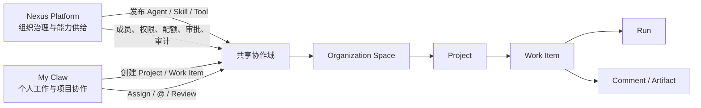
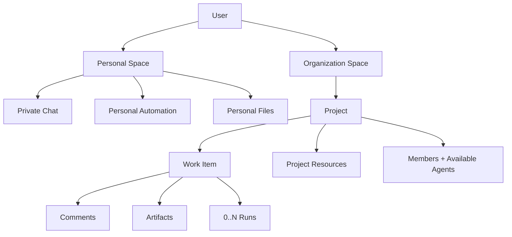
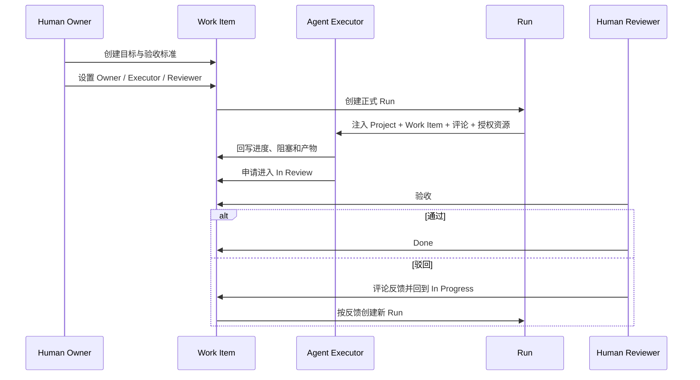

# 基于 Multica 机制的组织协作产品方案

> **已被新规格替代：** 本文中的 Project、Agent 与 Squad 定义已根据后续产品讨论修正。Coding Agent 实现时请以
> `docs/superpowers/specs/2026-07-27-my-claw-organization-collaboration-prototype-prd.md` 为唯一实现依据。

> 适用产品：Nexus Platform 管控端 + My Claw 使用端
> 结论版本：2026-07-27
> 参考材料：`/Users/nanbunan/个人/Unlimited Progress/raw/产品调研/Agent in Org. for collaboration/Multica调研.md`
> 方案性质：产品边界与基础信息架构，不代表当前代码已经实现

## 1. 结论

**组织协作的主要工作界面应放在 My Claw 使用端；Nexus Platform 负责组织级治理，不应承载日常协作。**

这不是在两个产品之间二选一，而是把同一套协作域拆成两个产品表面：

| 产品表面 | 核心角色 | 负责的问题 | 不应承担 |
|---|---|---|---|
| My Claw 使用端 | 业务用户、项目成员、Agent | 建项目、建工作项、分派、评论、执行、交接、验收 | 组织级配额、安全策略、资产发布与全局审计 |
| Nexus Platform 管控端 | 管理员、开发者、运营与安全人员 | 建组织空间、配置成员和角色、发布 Agent/Skill/工具、设置策略与配额、审批和审计 | Issue 看板、日常评论、任务协作和项目交付 |

一句话概括：

> **My Claw 是“事情发生的地方”，Nexus 是“事情被允许以什么方式发生的地方”。**

如果把 Issue、评论、Assign、Review 全部放进 Nexus，终端用户会被迫进入开发/管控产品完成日常工作，协作能力会退化成管理员功能；如果把配额、权限、工具准入和审计全部放进 My Claw，又会把使用端做成另一个管控台。

## 2. 为什么主界面应该在 My Claw

### 2.1 组织协作首先是使用行为，不是开发行为

Multica 中最高频的动作是：

- 看自己负责和待验收的工作；
- 创建、拆解和更新工作项；
- 指派人或 Agent；
- 在评论中补充上下文和 `@Agent`；
- 查看执行进度、失败原因和产物；
- 验收、驳回或重新发起执行。

这些动作面向项目成员，而不是 Agent 开发者。My Claw 当前已经承担会话、Agent 使用、自动化、文件与结果查看，天然更接近日常工作入口。

### 2.2 My Claw 已经具备承接协作的壳

当前实现已经有：

- 独立全屏 `/my-claw` 工作台；
- 左侧导航和会话列表；
- 会话、Agent、Skill、插件、自动化和文件；
- 多 Agent 演示与 Run / 工具调用展示；
- 左下角“个人空间”标识。

缺口不是再建一套应用，而是：

1. 把“个人空间”从静态标签升级成真正的工作上下文；
2. 增加组织项目上下文；
3. 在会话之外增加长期协作对象 `Work Item`；
4. 让 Work Item 与一次或多次 Run 建立明确关系。

### 2.3 Nexus 当前更适合作为控制面

Nexus 已有“空间运营”，并已经包含：

- 全局看板；
- 工具、技能；
- 运行配置；
- 审批；
- 日志；
- 运行风险和异常监控。

这些能力与组织协作的治理侧天然一致。它们应该控制项目和 Agent 的运行边界，而不是直接承载项目成员的工作流。

### 2.4 不依赖外部条件

本方案的协作闭环由内部对象完成：

`Project → Work Item → Comment → Run → Artifact → Review`

Git 仓库、本地目录、飞书、数据库或外部项目管理工具都只是可选资源，不是工作项存在和推进的前提。项目即使只配置项目说明、内部文件、成员和 Agent，也能完成协作闭环。

这正是它比强依赖外部系统同步或外部触发的形态更适合 Claw 的原因。

## 3. 产品对象模型

不建议直接照搬 Multica 的所有名词。Claw 首期应使用以下对象：

| 对象 | 中文名称 | 生命周期 | 核心职责 |
|---|---|---|---|
| `PersonalSpace` | 个人空间 | 随用户长期存在 | 私聊、个人文件、个人自动化、个人偏好 |
| `OrganizationSpace` | 组织空间 | 组织级长期存在 | 成员、角色、资产、权限、配额和审计边界 |
| `Project` | 项目 | 跨多次执行 | 目标、成员、共享说明、资源和工作项容器 |
| `WorkItem` | 工作项 | 跨多次 Run | 长期责任、业务状态、评论、产物和验收 |
| `Run` | 执行 | 一次触发到一次结束 | 排队、运行、成功、失败、取消、重跑 |
| `PrivateChat` | 私聊 | 个人多轮探索 | 用户与一个 Agent 的私有探索，不直接修改项目 |
| `Comment` | 评论 | 随 Work Item 持久存在 | 公共上下文、过程广播、交接和 `@Agent` 触发 |
| `Artifact` | 产物 | 随 Work Item / Run 持久存在 | 文件、报告、PR、链接和验收证据 |

### 3.1 不直接把 Agent 设为唯一责任人

Multica 把 Human、Agent、Squad 都放进同一个 Assignee 字段，产品上清晰，但企业问责容易悬空。Claw 建议拆成三个字段：

| 字段 | 类型 | 语义 |
|---|---|---|
| `Owner` | 必须是 Human | 对业务结果负责，保证事情有人收口 |
| `Executor` | Human / Agent / Agent Team | 当前由谁执行；选择 Agent 时触发 Run |
| `Reviewer` | Human，可按风险强制 | 决定业务是否完成 |

Agent Run 成功只能说明本次执行结束，不能直接把 Work Item 置为 Done。

### 3.2 责任动作与参与动作分开

- **指派 Executor**：表示“由你执行”，选择 Agent 后产生正式 Run。
- **评论中 `@Agent`**：表示“请提供意见或完成局部动作”，不改变 Owner 和 Executor。
- **Reviewer 通过**：Work Item 才进入 Done。
- **Reviewer 驳回**：回到 In Progress，并可从反馈评论重新触发 Run。

### 3.3 工作项与执行必须使用两套状态

Work Item 业务状态：

`Backlog / Todo / In Progress / In Review / Done / Blocked / Cancelled`

Run 进程状态：

`Queued / Dispatched / Running / Completed / Failed / Cancelled`

任何页面都不应只显示一个混合状态。例如应显示：

> 工作项：待验收 · 最近执行：已失败

而不是用一个“失败”覆盖业务状态。

## 4. My Claw 基础产品形态

## 4.1 空间与项目切换放在哪里

**放在左侧栏顶部、品牌区下方、主导航上方。**

当前左下角用户信息中的“个人空间”不适合作为切换入口，因为那里表达的是账号身份；工作上下文会影响整页数据、权限和导航，必须在用户进入功能前持续可见。

左侧顶部建议形成三层：

1. 品牌：`我的 Claw`
2. 工作上下文切换器：`个人空间` 或 `组织 / 项目`
3. 当前上下文内的功能导航

上下文切换器展开后：

| 分组 | 展示内容 |
|---|---|
| 个人 | `Rowan 的个人空间`，标注“仅自己可见” |
| 最近项目 | 最近访问和置顶项目 |
| 组织 | 按组织分组展示项目，可搜索 |
| 操作 | `浏览全部项目`、`新建项目`；管理员可看到 `前往 Nexus 管理组织空间` |

切换器的选中态必须明确显示：

- 个人：`个人空间`
- 项目：`Nexus 产品组 / Claw 1.5`

不要只显示“Claw 1.5”，否则用户无法判断它属于哪个组织，也容易把文件或评论写错空间。

### 4.1.1 路由建议

工作上下文应进入 URL，避免刷新、分享深链或新开标签后丢失作用域：

| 路由 | 作用域 |
|---|---|
| `/my-claw/personal/*` | 个人空间 |
| `/my-claw/org/:orgId/project/:projectId/*` | 组织项目 |
| `/my-claw` | 兼容入口，重定向到最近使用的上下文，首次进入默认个人空间 |
| `/my-claw/chat` | 兼容当前实现，后续重定向到个人会话路由 |

## 4.2 左侧导航

建议保留同一套 My Claw 壳，但导航随上下文切换：

| 导航区域 | 个人空间 | 项目空间 |
|---|---|---|
| 工作 | 新建会话、最近会话 | 项目概览、工作项、团队动态 |
| 资源 | 文件、自动化 | 项目文件、自动化 |
| 能力 | Agent、Skill、插件 | 项目 Agent、可用 Skill、可用插件 |
| 底部 | 用户账号、个人配置 | 用户账号；项目设置入口仅对 Lead 可见 |

个人会话列表与项目工作项列表不能混在一起。切换到项目后，左侧列表应变成：

- 分配给我；
- 待我验收；
- Agent 执行中；
- 阻塞；
- 最近更新。

## 4.3 项目首页

项目首页不应先展示空白聊天框，而应回答五个问题：

1. 项目要达成什么目标；
2. 我现在需要处理什么；
3. 哪些 Agent 正在执行；
4. 哪些事情被阻塞或等待验收；
5. 最近产生了哪些重要结果。

首页模块建议：

| 模块 | 内容 |
|---|---|
| 项目摘要 | 项目目标、Lead、成员、可用 Agent、关键资源 |
| 我的工作 | 分配给我、待我验收、我关注的工作项 |
| 执行态势 | Running / Queued / Failed Run，支持进入详情 |
| 阻塞与风险 | Blocked 工作项、失败重试、权限或资源问题 |
| 最近动态 | 评论、状态变化、产物、成员和资源变更 |

## 4.4 工作项列表

首期提供 List + Board 两种视图即可，不先做工作流画布。

基础筛选：

- 我的工作；
- 待验收；
- Agent 执行中；
- 阻塞；
- 状态、Owner、Executor、优先级和更新时间。

卡片至少显示：

- 标题；
- 业务状态；
- Human Owner；
- 当前 Executor；
- 最近 Run 状态；
- 评论和产物数量；
- 是否等待验收。

## 4.5 工作项详情

工作项详情是组织协作的核心页面：

| 区域 | 内容 |
|---|---|
| 顶部 | 标题、状态、优先级、Project、父工作项 |
| 主区 | 描述、验收标准、子工作项、评论时间线、附件与产物 |
| 右栏 | Owner、Executor、Reviewer、截止时间、可用 Agent、Run 历史 |
| 评论输入 | 普通评论、`@Agent`、附加文件、引用某次 Run 或产物 |
| Run 抽屉 | 本次输入、上下文来源、步骤、工具调用、失败原因、重跑 |

用户必须能一眼分辨三类信息：

- 项目成员写的公共评论；
- Agent 回写的协作结论；
- 系统生成的状态与 Run 事件。

不要把完整工具 Trace 直接铺进评论流；评论流展示摘要，详细 Trace 进入 Run 抽屉。

## 4.6 私聊与项目协作的边界

个人空间中的 Private Chat：

- 仅当前用户可见；
- 不自动读取项目工作项和评论；
- 不允许直接修改项目状态；
- 可读取用户明确选择的项目材料，但要显示来源；
- 可以通过“转为项目工作项”升级为正式协作。

“转为项目工作项”不能静默复制整个私聊。应先让用户选择：

1. 目标组织和项目；
2. 要公开的消息、摘要、附件和产物；
3. Owner、Executor、Reviewer；
4. 验收标准。

创建后，原私聊仍保持私有；项目成员只看到用户确认公开的内容。

## 4.7 项目创建

有权限的终端用户应在 My Claw 创建项目，因为“新建项目”是业务发起动作。Nexus 提供治理模板和约束。

My Claw 项目创建表单：

- 项目名称与目标；
- 所属组织空间；
- Project Lead；
- 成员；
- 可用 Agent；
- 项目说明；
- 内部文件、知识库、仓库、目录或 Connector 资源；
- 继承的项目模板与运行策略。

若所选资源需要管理员批准，则项目可以先创建，但资源显示“待审批”，不阻塞项目基础协作。

## 5. Nexus Platform 应放在哪里

组织协作的管控能力应进入现有 **业务管理 → 空间运营**，而不是放进“智能体开发 → Claw”或“智能体”。

原因：

- Claw / Agent 页面负责构建和发布能力；
- 空间运营已经承担空间级资源、运行和风险治理；
- 一个项目会使用多个 Agent、Skill、工具和知识资源，不应从属于某一个 Claw。

建议把“空间运营”扩展为：

| 一级 Tab | 主要能力 |
|---|---|
| 全局看板 | 组织空间、项目、工作项、Run、异常和成本概览 |
| 空间与项目 | 组织空间生命周期、项目列表、归档、跨空间规则 |
| 成员与角色 | Admin、Project Lead、Member、Reviewer 等角色 |
| 工具 | 现有能力；配置空间可用工具和外部连接 |
| 技能与 Agent | 组织发布、准入、版本和项目可见范围 |
| 运行策略 | 现有运行配置；并发、时长、Token、重试和自动化限制 |
| 审批 | 高风险工具、跨空间资源、外部发布和权限提升 |
| 审计日志 | 成员、资源、权限、工作项状态、Agent 执行与产物审计 |

Nexus 可以查看项目和 Work Item 的全局统计与审计记录，但不提供日常工作项看板和评论入口。管理员需要介入某个项目时，应通过深链进入 My Claw 对应项目，并按自己的项目角色操作。

## 6. 关键交互契约

### 6.1 正式交付

### 6.2 Agent 会诊

1. Owner 保持不变；
2. 评论中 `@一个或多个 Agent`；
3. 每个 Agent 产生独立 Run；
4. Agent 结论回到同一公共评论时间线；
5. Owner 或 Executor 汇总结论，不因某个会诊 Run 完成自动关闭工作项。

### 6.3 外部资源不可用

仓库、Connector 或本地 Runtime 不可用时：

- Run 进入 Failed 或 Blocked；
- Work Item 不消失，也不自动取消；
- 评论、描述、内部文件和既有产物仍可访问；
- Human 可换 Agent、换资源、重跑或人工接管。

这保证外部条件只影响某次执行，不摧毁协作账本。

## 7. 比 Multica 更适合企业 Claw 的三个改进

### 7.1 Human Owner 与 Agent Executor 分离

既保留 Agent 是一等执行者，又不让业务责任落到一个不可问责的系统账号上。

### 7.2 结构化验收

在 In Review 中增加：

- 验收标准清单；
- 产物与证据；
- 自动检查结果；
- Reviewer；
- 通过或驳回原因；
- 高风险工作项的强制人工 Gate。

### 7.3 私聊转工作项的显式公开

支持从探索到正式协作，但由用户选择公开内容，避免把私人对话和未成熟判断直接暴露给项目成员。

## 8. MVP 范围

### P0：先形成闭环

1. My Claw 顶部工作上下文切换；
2. 个人空间与组织项目的数据隔离；
3. 项目列表、项目首页；
4. Work Item 列表 / Board 与详情；
5. Human Owner、Agent Executor、Human Reviewer；
6. Assign、`@Agent`、评论和产物；
7. Work Item / Run 双状态；
8. 人工验收和驳回；
9. Nexus 空间成员、可用 Agent、配额和审计；
10. 私聊选择性转 Work Item。

### P1：增强复杂协作

- Sub-Work Item；
- Project 模板；
- 多 Agent 会诊；
- 自动化创建 Work Item；
- 项目级资源挂载和审批；
- 通知与 Inbox；
- 失败重试和人工接管。

### P2：复杂组织编排

- Agent Team / Squad；
- Stage；
- 依赖关系；
- 跨项目协作；
- 组织级工作流策略；
- 自动验收和风险 Gate。

首期不建议直接做：

- 复杂工作流画布；
- 任意层级项目树；
- 所有 Agent 共享一个隐形大上下文；
- 把外部项目管理工具设为必选依赖；
- Run 完成自动等于业务 Done。

## 9. 对当前实现的具体改动点

| 当前实现 | 建议 |
|---|---|
| `components/my-claw/shell/sidebar.tsx` 左下角展示“个人空间” | 左下角只保留账号；在品牌区下新增持久的工作上下文切换器 |
| `components/my-claw/shell/session-list.tsx` 只管理会话和自动化 | 个人上下文继续展示会话；项目上下文切换为“与我相关”的工作项分组 |
| `components/my-claw/provider.tsx` 只保存会话、Agent 和自动化状态 | 增加 `activeContext`、Project、Work Item、Run 与权限作用域 |
| `/my-claw` 当前默认打开空白会话 | 个人上下文保持新会话；项目上下文默认进入项目首页 |
| `app/(dashboard)/space-operations/*` 已有治理 Tab | 增加空间/项目、成员与角色、Agent 准入；保留运行配置、审批、日志 |
| `ClawWorkspaceSection` 表达单 Claw 文件空间 | 项目资源建立独立对象，不把项目资源塞进某个 Claw 的工作目录配置 |

## 10. 最终判断

如果必须只选一端，选择 **My Claw 使用端**。

但真正可落地的产品结构应该是：

> **My Claw 承载个人与项目工作，Nexus Platform 承载组织治理；两端共享同一套 Space / Project / Work Item / Run / Resource / Permission 数据模型。**

最先应该设计和验证的不是 Nexus 中新增哪个菜单，而是 My Claw 的两个核心页面：

1. 顶部“个人空间 / 组织项目”工作上下文切换器；
2. 项目模式下的 Work Item 列表与详情。

这两个页面一旦成立，Nexus 侧的空间、成员、资产、配额和审计都会自然找到自己的位置。
